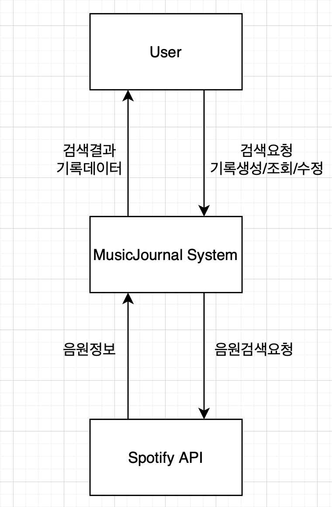

# 1. Conceptualization

## Project Title : MusicJournal
#### 22211977, 김대현, kdh031230@gmail.com

___

## [Revision history]
| Revision date | Vesion # | Description | Author |
|---------------|----------|-------------|--------|
| 03/17/26      | 1.01     | 초안          | 김대현   |
| 03/27/26      | 1.02     | 가독성 개선 및 Problem #1 Spotify API 정책 변경 내용 추가  | 김대현   |

---

## == Contents ==
### 1. Business purpose
### 2. System context diagram
### 3. Use case list
### 4. Concept of operation
### 5. Problem statement
### 6. Glossary
### 7. Reference

---

## 1. Business purpose
### 1.1 Project background
기존 스트리밍 서비스에서는 단순한 재생 기록이나 플레이리스트 수준에 머물러 음악에 대한 개인적 코멘트를 남기거나
일상과 연결하기 어렵다. 
일부 서비스에서는 월별 청취 기록을 제공하지만, 일자별로 어떤 음악을 들었는지, 그날의 상황과 함께 기록하는 기능은 제공되지 않는다.

본 프로젝트는 사용자가 직접 선택한 음악에 대해 코멘트를 남기고, 일자별로 기록하며, 필요에 따라 그날의 활동이나 상황도 함께 적을 수 있는 코멘트 중심 수동 음악 일기 서비스를 제공한다. 
음악의 장르, 아티스트 등 메타데이터를 활용해 기록을 정리하여, 또한 어떤 아티스트를 주로 들었는지, 장르별 청취 비중 등과 같은 데이터 통계를 제공하여 사용자가 자신의 음악 취향과 패턴을 한눈에 파악할 수 있도록 한다. 
이를 통해 사용자는 자신의 음악 경험과 그날의 활동을 개인적 코멘트와 함께 체계적으로 기록하고, 음악을 통한 회고와 자기 표현을 경험할 수 있다.

### 1.2 Goal
- 일자별로 사용자가 선택한 음원과 음원에 대한 코멘트를 기록할 수 있어야한다
- 사용자는 음원제목이나 아티스트명을 통해 음원을 검색할 수 있어야한다
- 기존 기록을 수정하거나 삭제할 수 있어야한다
- 기록한 음원에 대한 통계 기능을 제공한다

---

## 2. System context diagram

---

## 3. Use case list

- 회원가입

| Actor | Description                |
|:------|:---------------------------|
| Guest | 방문자는 회원가입을 하여 본인의 계정을 생성한다 |

- 로그인

| Actor | Description        |
|:------|:-------------------|
| Guest | 방문자는 본인의 계정으로 접속한다 |

- 음원 검색

| Actor | Description                        |
|:------|:-----------------------------------|
| User  | 사용자는 자신이 원하는 음원을 아티스트명이나 제목으로 검색한다 |

- 검색 결과 조회

| Actor | Description      |
|:------|:-----------------|
| User  | 사용자는 검색 결과를 확인한다 |

- 날짜 선택

| Actor | Description             |
|:------|:------------------------|
| User  | 사용자는 음악일기를 기록할 날짜를 선택한다 |

- 음원 추가

| Actor | Description          |
|:------|:---------------------|
| User  | 사용자는 검색을 통해 일기에 추가한다 |

- 코멘트 작성

| Actor | Description                                            |
|:------|:-------------------------------------------------------|
| User  | 사용자는 선택한 음원에 대한 자신의 생각, 느낀점, 기분, 있었던 일 등 다양한 코멘트를 작성한다 |

- 기록 저장

| Actor | Description       |
|:------|:------------------|
| User  | 사용자는 기록한 일기를 저장한다 |

- 기록 조회

| Actor | Description       |
|:------|:------------------|
| User  | 사용자는 기록한 일기를 조회한다 |

- 기록 수정

| Actor | Description       |
|:------|:------------------|
| User  | 사용자는 기록한 일기를 수정한다 |

- 기록 삭제

| Actor | Description       |
|:------|:------------------|
| User  | 사용자는 기록한 일기를 삭제한다 |

- 통계 조회

| Actor | Description                     |
|:------|:--------------------------------|
| User  | 사용자는 사용자가 기록한 음원기록에 대한 통계를 확인한다 |

- 로그아웃

| Actor | Description       |
|:------|:------------------|
| User  | 사용자는 본인의 계정에서 나간다 |

---

## 4. Concept of Operation
1. 회원가입
- **Purpose**: 방문자가 서비스 이용을 위해 본인의 계정을 생성할 수 있도록 한다
- **Approach**: 방문자는 아이디, 비밀번호 등 필요한 정보를 입력하여 회원가입을 요청하고, 시스템은 입력값을 검증한 후 계정을 생성한다
- **Dynamics**: 시스템은 입력된 정보의 유효성을 확인하고 중복 여부를 검사한 뒤 정상적인 경우 사용자 계정을 생성하고 저장한다
- **Goals**: 사용자가 개인 계정을 기반으로 음악 일기 서비스를 지속적으로 이용할 수 있도록 한다

2. 로그인
- **Purpose**: 기존 사용자가 자신의 계정을 통해 서비스에 접근할 수 있도록 한다
- **Approach**: 사용자는 아이디와 비밀번호를 입력하여 로그인을 요청하고, 시스템은 입력된 정보를 검증한다
- **Dynamics**: 시스템은 입력된 계정 정보가 저장된 사용자 정보와 일치하는지 확인하고, 인증이 성공하면 사용자 세션을 생성한다
- **Goals**: 사용자가 자신의 계정으로 음악 일기 기록 및 관리 기능을 이용할 수 있도록 한다

3. 음원 검색
- **Purpose**: 사용자가 원하는 음원을 쉽게 찾을 수 있도록 한다
- **Approach**: 사용자는 트랙명 또는 아티스트명을 입력하여 검색을 요청하고, 시스템은 Spotify API를 통해 검색 결과를 가져온다
- **Dynamics**: 시스템은 입력된 키워드를 기반으로 외부 API를 호출하여 관련 음원 목록을 조회하고, 결과를 사용자에게 반환한다
- **Goals**: 사용자가 기록하고자 하는 음원을 빠르고 정확하게 선택할 수 있도록 지원한다

4. 검색 결과 조회
- **Purpose**: 사용자가 검색한 음원의 목록을 확인할 수 있도록 한다
- **Approach**: 시스템은 검색 요청에 대한 결과로 트랙명, 아티스트명, 앨범커버 등의 정보를 포함한 목록을 사용자에게 제공한다
- **Dynamics**: 시스템은 API로부터 받은 데이터를 가공하여 리스트 형태로 출력하고, 사용자는 각 음원을 선택할 수 있다
- **Goals**: 사용자가 검색 결과를 기반으로 원하는 음원을 직관적으로 탐색하고 선택할 수 있도록 한다

5. 날짜 추가
- **Purpose**:사용자가 선택한 음원을 특정 날짜의 음악 일기에 포함할 수 있도록 한다
- **Approach**:사용자는 선택한 음원을 기록에 추가하는 요청을 수행한다
- **Dynamics**:시스템은 선택된 날짜와 음원 정보를 연결하여 하나의 기록 단위로 저장 준비 상태를 구성한다
- **Goals**:사용자가 원하는 음원을 일기 기록에 반영하여 체계적으로 관리할 수 있도록 한다

6. 코멘트 작성
- **Purpose**: 사용자가 선택한 음원에 대한 개인적인 생각이나 경험을 기록할 수 있도록 한다
- **Approach**:사용자는 텍스트 입력을 통해 음원에 대한 코멘트를 작성한다
- **Dynamics**: 시스템은 입력된 코멘트를 해당 음원 및 날짜 정보와 함께 저장한다
- **Goals**: 사용자가 음악과 관련된 개인적인 경험을 함께 기록하여 의미 있는 음악 일기를 구성할 수 있도록 한다

7. 기록 저장 
- **Purpose**: 사용자가 입력한 음원 정보와 코멘트를 하나의 음악 일기로 저장할 수 있도록 한다
- **Approach**: 사용자는 작성한 코멘트와 선택한 음원 및 날짜 정보를 저장 요청한다
- **Dynamics**: 시스템은 날짜, 음원 정보, 코멘트를 하나의 기록으로 구성하여 데이터베이스에 저장한다
- **Goals**: 사용자가 작성한 음악 일기를 안정적으로 보관하고 이후 조회 및 관리할 수 있도록 한다

8. 기록 조회
- **Purpose**: 사용자가 저장한 음악 일기를 확인할 수 있도록 한다
- **Approach**: 사용자는 특정 날짜 또는 전체 기록을 조회 요청한다
- **Dynamics**: 시스템은 저장된 데이터를 조회하여 날짜별 음악 기록과 코멘트를 사용자에게 제공한다
- **Goals**:사용자가 자신의 음악 기록을 쉽게 확인하고 회고할 수 있도록 한다

9. 기록 수정
- **Purpose**: 사용자가 기존에 저장한 음악 일기의 내용을 변경할 수 있도록 한다
- **Approach**: 사용자는 수정할 기록을 선택하고 코멘트 등의 내용을 수정한 후 저장 요청한다
- **Dynamics**: 시스템은 해당 기록을 조회한 뒤 변경된 내용을 반영하여 업데이트한다
- **Goals**: 사용자가 자신의 음악 기록을 상황에 맞게 유연하게 관리할 수 있도록 한다

10. 기록 삭제
- **Purpose**: 사용자가 더 이상 필요하지 않은 음악 일기를 제거할 수 있도록 한다
- **Approach**: 사용자는 삭제할 기록을 선택하고 삭제 요청을 수행한다
- **Dynamics**: 시스템은 해당 기록을 식별한 후 데이터베이스에서 삭제한다
- **Goals**: 사용자가 불필요한 기록을 정리하여 음악 일기를 효율적으로 관리할 수 있도록 한다

11. 통계 조회
- **Purpose**: 사용자가 자신의 음악 기록을 기반으로 청취 패턴을 파악할 수 있도록 한다
- **Approach**: 사용자는 통계 조회를 요청하고, 시스템은 저장된 기록 데이터를 분석하여 결과를 생성한다
- **Dynamics**: 시스템은 기록 데이터를 집계하여 아티스트별, 장르별, 날짜별 통계를 계산하고 이를 사용자에게 제공한다
- **Goals**: 사용자가 자신의 음악 취향과 기록 패턴을 직관적으로 이해할 수 있도록 한다

12. 로그아웃 
- **Purpose**: 사용자가 현재 세션을 종료하고 서비스 이용을 마칠 수 있도록 한다
- **Approach**: 사용자는 로그아웃 요청을 수행한다
- **Dynamics**: 시스템은 사용자 세션을 종료하고 인증 정보를 제거한다
- **Goals**: 사용자가 안전하게 계정을 종료하고, 개인 정보 보호를 유지할 수 있도록 한다

---

## 5. Problem statement
### Problem #1
Spotify API에 의존하여 음원 검색 및 관련 데이터를 제공하는 구조는 서비스의 안정성과 성능이 외부 시스템에 영향을 받는다는 문제를 가진다.
API 호출 제한(rate limit)이나 응답 지연, 또는 일시적인 서버 장애가 발생할 경우, 사용자에게 검색 결과가 정상적으로 제공되지 않을 수 있으며
이는 전반적인 사용자 경험 저하로 이어질 수 있다. 
또한 Spotify는 2026년 2월부터 Development Mode 사용 자체에 Premium 구독을 요구하고, 검색 결과 수를 최대 10건으로 제한하는 등 API 접근 정책을 강화하였다.
이로 인해 개발 및 테스트 환경에서의 검색 품질이 저하될 수 있으며, 향후 정책 변경에 따라 서비스 운영에 추가적인 제약이 발생할 가능성이 있다.

### Problem #2
수동 기록 방식을 기반으로 하는 서비스는 사용자가 직접 음원을 검색하고 코멘트를 작성해야 하기 때문에 입력 과정에서 번거로움을 느낄 수 있다는 한계를 가진다.  
이러한 불편함은 사용자의 지속적인 이용을 저해할 수 있으며, 기록 빈도 감소로 이어질 가능성이 있다.  
따라서 사용자 입력 과정을 최대한 간소화하고 직관적인 UI/UX를 제공하여 기록 부담을 줄이는 설계가 필요하다.

### Problem #3
사용자의 음악 기록 데이터가 지속적으로 누적됨에 따라, 기록 조회 및 통계 생성 과정에서 성능 저하가 발생할 수 있다.  
특히 날짜별 기록 조회나 아티스트별 통계와 같은 기능은 데이터 양이 많아질수록 처리 비용이 증가하게 되며, 이는 응답 지연으로 이어질 수 있다.

### Problem #4
음악 기록을 기반으로 제공되는 통계가 단순한 데이터 나열이나 카운팅에 그칠 경우, 사용자에게 실질적인 가치를 제공하지 못할 수 있다.  
예를 들어 단순히 많이 들은 아티스트 목록만 제공하는 것은 사용자의 행동이나 패턴을 충분히 반영하지 못할 수 있으며, 서비스의 활용도를 낮출 수 있다.

### Problem #5
서비스의 전체 흐름이 복잡하거나 입력 단계가 많을 경우, 사용자는 기록 과정에서 불편함을 느끼고 이탈할 가능성이 있다.  
특히 “음원 검색 → 선택 → 코멘트 작성 → 저장”으로 이어지는 과정이 직관적이지 않으면 사용성이 크게 저하될 수 있다.

### NFRs
a. 음원 검색 및 기록 조회 기능은 사용자 요청 후 짧은 시간 내에 응답해야 하며, 데이터가 누적되더라도 일정 수준 이상의 성능을 유지해야 한다.

b. 사용자는 최소한의 입력 단계로 음악 기록을 작성할 수 있어야 하며, 직관적인 UI/UX를 제공해야 한다.

c. 사용자 계정 정보와 기록 데이터는 안전하게 보호되어야 하며, 인증된 사용자만 자신의 데이터에 접근할 수 있어야 한다.

d. 시스템은 향후 기능 확장을 고려하여 유지보수성과 확장성이 용이한 구조로 설계되어야 한다.

---

## 6. Glossary
| 용어    | 설명                            |
|:------|:------------------------------|
|Spotify API | 음원 검색 및 데이터를 제공하는 외부 API      |
| Track | API에서 제공하는 개별 음원 단위           |
|MetaData| 음원에 대한 부가 정보 (아티스트, 앨범, 장르 등) |

---

## 7. Reference
1. Spotify Web API Documentation: https://developer.spotify.com/documentation/web-api/