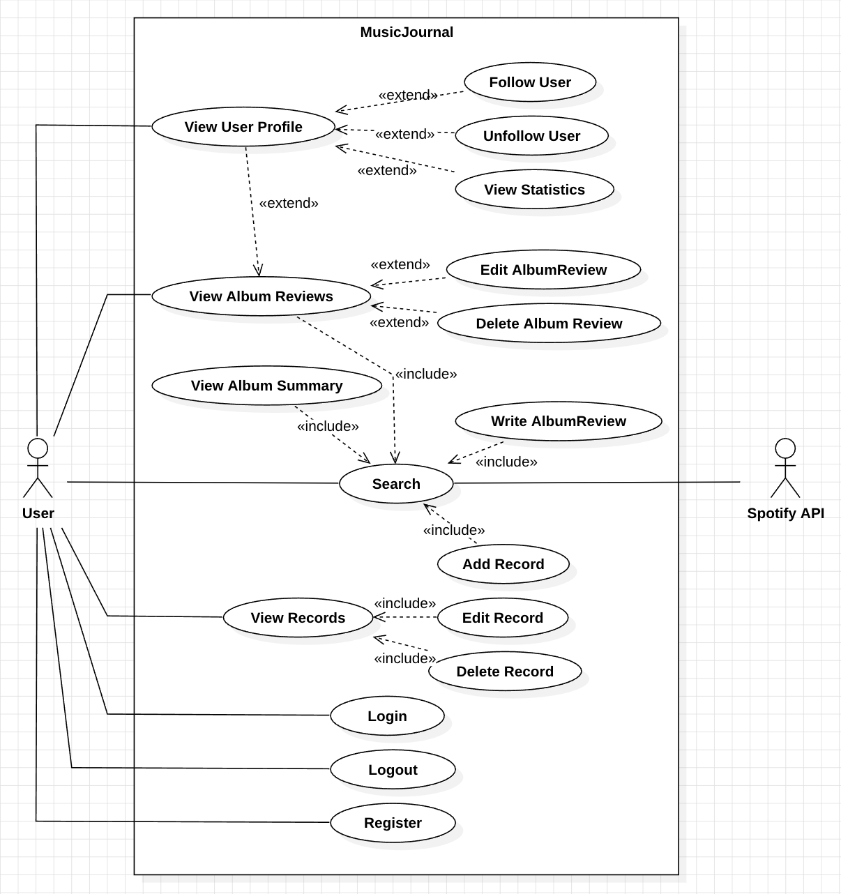

# 2. Analysis

## Project Title : MusicJournal
#### 22211977, 김대현, kdh031230@gmail.com
#### GitHub Repository: https://github.com/meoooogus/music_journal

___

## [Revision history]
| Revision date | Version # | Description                              | Author |
|---------------|-----------|------------------------------------------|--------|
| 04/08/26      | 1.0.0     | 초안                                       | 김대현   |
| 04/08/26      | 1.0.1     | 내용 보완                                    | 김대현   |
| 05/01/26      | 1.1.0     | Use Case 및 Domain analysis 상세화           | 김대현   |
| 05/04/26      | 1.1.1     | 1.1 Summary 내용 개선                        | 김대현   |
| 05/04/26      | 1.2.0     | Domain analysis 전면 개정                    | 김대현   |
| 05/04/26      | 1.2.1     | 통계 항목 수정 — 트랙별 통계 제거                     | 김대현   |
| 05/06/26      | 1.3.0     | 커뮤니티 기능 확장 반영                            | 김대현   |
| 05/06/26      | 1.4.0     | TrackReview → AlbumReview 전환 반영          | 김대현   |
| 05/06/26      | 1.5.0     | username unique·변경 불가 반영, 프로필 접근 flow 변경 | 김대현   |
| 05/06/26      | 1.6.0     | 프로필 설계 변경                                | 김대현   |

---

## == Contents ==
### 1. Introduction
### 2. Use case analysis
### 3. Domain analysis
### 4. User Interface Prototype
### 5. Glossary
### 6. Reference

---

## 1. Introduction

본 문서는 Conceptualization 단계의 문서에 이어지는 Analysis 단계의 문서다.

### 1.1 Summary

본 서비스는 트랙 단위의 청취 일기와 앨범 단위의 평론·평점을 결합한
취향 중심 음악 플랫폼이다.

일기 기능에서는 Spotify API를 통해 트랙을 검색하고 날짜별로 기록하며
코멘트를 남길 수 있다. 트랙 검색 시 해당 앨범의 평점 요약이 함께 노출되어
평론 서비스로 자연스럽게 연결된다.

평론 기능에서는 앨범을 검색하고 평점·평론·추천 앨범을 작성하며
다른 사용자의 평론을 탐색할 수 있다.
이를 통해 사용자는 자신의 음악 취향을 언어화하고 깊이 정립할 수 있다.

### 1.2 Business Goals

- 사용자가 날짜별로 음원을 기록하고 개인 코멘트를 작성할 수 있어야 한다.
- 사용자가 Spotify API를 통해 원하는 음원을 키워드로 쉽게 검색할 수 있어야 한다.
- 사용자가 자신의 기록을 조회, 수정, 삭제할 수 있어야 한다.
- 사용자가 자신의 음악 청취 패턴을 통계로 확인할 수 있어야 한다.
- 회원가입 및 로그인을 통해 개인화된 서비스를 제공해야 한다.
- 사용자가 앨범에 대한 평점과 평론을 작성하고 다른 사용자와 공유할 수 있어야 한다.
- 사용자가 특정 앨범의 평론 목록을 조회할 수 있어야 한다.
- 사용자가 앨범 평론을 통해 추천 앨범을 등록하고 조회할 수 있어야 한다.
- 사용자가 트랙 검색 시 해당 앨범의 평점 요약을 확인할 수 있어야 한다.
- 사용자가 다른 사용자의 프로필과 평론을 탐색할 수 있어야 한다.
- 사용자가 다른 사용자를 팔로우하여 취향 기반의 관계를 형성할 수 있어야 한다.

### 1.3 Technical Goals

- Spotify Web API를 통해 음원 메타데이터(제목, 아티스트, 앨범, 앨범 커버 등)를 정확히 가져올 수 있어야 한다.
- JWT 기반 인증으로 사용자 세션을 Stateless하게 관리해야 한다.
- Spring Security를 통해 인증/인가가 적용된 안전한 API를 제공해야 한다.
- RESTful API 설계 원칙을 준수하여 확장 가능한 구조를 갖춰야 한다.
- 시스템의 응답속도는 사용자에게 불편함을 주어서는 안 된다.

---

## 2. Use case analysis

### 2.1 Use Case Diagram

그림 2-1은 Use Case List를 바탕으로 한 Use Case Diagram이다.

- Register 회원가입
- Login 로그인
- Logout 로그아웃
- Search 트랙/앨범 검색 (타입 선택)
- Add Record 날짜별 음원 추가 및 코멘트 작성
- View Records 기록 조회
- Edit Record 기록 수정
- Delete Record 기록 삭제
- View Statistics 통계 조회 (내 프로필 페이지 내 통계 섹션)
- Write AlbumReview 앨범 평점·평론·추천 앨범 작성
- Edit AlbumReview 앨범 평점·평론·추천 앨범 수정
- Delete AlbumReview 앨범 평점·평론·추천 앨범 삭제
- View Album Reviews 앨범 평론 목록 조회 (추천 앨범 포함)
- View Album Summary 트랙 검색 시 앨범 평점 요약 조회
- View User Profile 본인 또는 유저 프로필 조회 (본인 시 통계 포함)
- Follow User 팔로우
- Unfollow User 언팔로우

### 2.2 Use Case Description

| **Use case #1 : Register** |                                                             |
|---|-------------------------------------------------------------|
| **GENERAL CHARACTERISTICS** |                                                             |
| Summary | 사용자가 이메일, 비밀번호, 닉네임을 입력하여 MusicJournal 서비스에 회원으로 등록하기 위한 기능 |
| Scope | MusicJournal                                                |
| Level | User Level                                                  |
| Author | 김대현                                                         |
| Last Update | 05/01/26                                                    |
| Status | Analysis                                                    |
| Primary Actor | User                                                        |
| Preconditions | 시스템이 실행되어 있어야 한다.                                           |
| Trigger | 사용자가 이메일, 비밀번호, 닉네임을 입력하고 회원가입 버튼을 클릭할 때                    |
| Success Post Condition | 사용자 계정이 생성되고 로그인 가능 상태가 된다.                                 |
| Failed Post Condition | 회원가입에 실패하고 사용자는 서비스를 이용할 수 없는 상태로 남는다.                      |
| **MAIN SUCCESS SCENARIO** |                                                             |
| Step | Action                                                      |
| S | 사용자가 MusicJournal에 회원가입을 한다.                                |
| 1 | 이 Use case는 사용자가 이메일, 비밀번호, 닉네임을 입력하고 회원가입 버튼을 클릭할 때 시작된다.  |
| 2 | 사용자는 이메일, 비밀번호, 닉네임을 입력하고 회원가입 버튼을 클릭한다.                    |
| 3 | 시스템은 입력된 이메일과 사용자명(username)의 중복 여부를 DB에서 확인한다.              |
| 4 | 시스템은 입력된 비밀번호를 BCrypt 알고리즘으로 암호화하여 사용자 정보를 DB에 저장한다.        |
| 5 | 시스템은 회원가입 성공 응답(HTTP 201)을 반환한다.                            |
| 6 | 이 Use case는 회원가입이 성공적으로 완료되면 끝난다.                           |
| **EXTENSION SCENARIOS** |                                                             |
| Step | Branching Action                                            |
| 3 | 3a. 이미 존재하는 이메일인 경우                                         |
| | 　...3a1. 시스템은 "이미 사용 중인 이메일입니다." 오류 메시지를 반환한다.              |
| | 　...3a2. 사용자는 이메일을 수정하여 회원가입을 다시 시도한다. (Step 2)             |
| 3 | 3b. 이미 존재하는 사용자명인 경우                                         |
| | 　...3b1. 시스템은 "이미 사용 중인 사용자명입니다." 오류 메시지를 반환한다.             |
| | 　...3b2. 사용자는 사용자명을 수정하여 회원가입을 다시 시도한다. (Step 2)            |
| **RELATED INFORMATION** |                                                             |
| Performance | ≤ 1 Seconds                                                 |
| Frequency | 사용자당 1회                                                     |
| Concurrency | 제한 없음                                                       |
| Due Date |                                                             |

---

| **Use case #2 : Login** |                                                             |
|---|-------------------------------------------------------------|
| **GENERAL CHARACTERISTICS** |                                                             |
| Summary | 사용자가 이메일과 비밀번호를 입력하여 MusicJournal에 로그인하고 JWT 토큰을 발급받기 위한 기능 |
| Scope | MusicJournal                                                |
| Level | User Level                                                  |
| Author | 김대현                                                         |
| Last Update | 05/01/26                                                    |
| Status | Analysis                                                    |
| Primary Actor | User                                                        |
| Preconditions | 사용자 계정이 DB에 존재해야 한다.                                        |
| Trigger | 사용자가 이메일과 비밀번호를 입력하고 로그인 버튼을 클릭할 때                          |
| Success Post Condition | JWT Access Token과 Refresh Token이 발급되고 서비스의 모든 기능을 이용할 수 있다. |
| Failed Post Condition | 로그인에 실패하고 사용자는 인증이 필요한 기능을 이용할 수 없다.                        |
| **MAIN SUCCESS SCENARIO** |                                                             |
| Step | Action                                                      |
| S | 사용자가 MusicJournal에 로그인을 한다.                                 |
| 1 | 이 Use case는 사용자가 이메일과 비밀번호를 입력하고 로그인 버튼을 클릭할 때 시작된다.        |
| 2 | 사용자는 이메일과 비밀번호를 입력하고 로그인 버튼을 클릭한다.                          |
| 3 | 시스템은 입력된 이메일로 사용자를 DB에서 조회한다.                               |
| 4 | 시스템은 입력된 비밀번호와 DB에 저장된 암호화된 비밀번호를 비교한다.                     |
| 5 | 시스템은 JWT Access Token과 Refresh Token을 생성하여 반환한다.            |
| 6 | 이 Use case는 로그인이 성공하면 끝난다.                                  |
| **EXTENSION SCENARIOS** |                                                             |
| Step | Branching Action                                            |
| 3 | 3a. 입력된 이메일로 가입된 사용자가 존재하지 않는 경우                            |
| | 　...3a1. 시스템은 "존재하지 않는 이메일입니다." 오류 메시지를 반환한다.               |
| | 　...3a2. 사용자는 이메일과 비밀번호를 다시 입력하는 단계로 돌아간다. (Step 2)         |
| 4 | 4a. 입력된 비밀번호가 저장된 비밀번호와 일치하지 않는 경우                          |
| | 　...4a1. 시스템은 "이메일 또는 비밀번호가 올바르지 않습니다." 오류 메시지를 반환한다.       |
| | 　...4a2. 사용자는 이메일과 비밀번호를 다시 입력하는 단계로 돌아간다. (Step 2)         |
| **RELATED INFORMATION** |                                                             |
| Performance | ≤ 1 Seconds                                                 |
| Frequency | 사용자당 하루 평균 1~2회                                             |
| Concurrency | 제한 없음                                                       |
| Due Date |                                                             |

---

| **Use case #3 : Logout** |                                                 |
|---|-------------------------------------------------|
| **GENERAL CHARACTERISTICS** |                                                 |
| Summary | 사용자가 로그아웃하여 발급된 Refresh Token을 무효화하기 위한 기능      |
| Scope | MusicJournal                                    |
| Level | User Level                                      |
| Author | 김대현                                             |
| Last Update | 05/01/26                                        |
| Status | Analysis                                        |
| Primary Actor | User                                            |
| Preconditions | 사용자가 로그인 상태여야 한다. (유효한 Access Token 보유)         |
| Trigger | 사용자가 로그아웃 버튼을 클릭할 때                             |
| Success Post Condition | Refresh Token이 무효화되고 사용자는 로그아웃 상태가 된다.          |
| Failed Post Condition | 로그아웃에 실패하고 세션이 유지된다.                            |
| **MAIN SUCCESS SCENARIO** |                                                 |
| Step | Action                                          |
| S | 사용자가 MusicJournal에서 로그아웃을 한다.                   |
| 1 | 이 Use case는 사용자가 로그아웃 버튼을 클릭할 때 시작된다.           |
| 2 | 사용자는 로그아웃 버튼을 클릭한다.                             |
| 3 | 시스템은 요청 헤더의 Access Token을 검증한다.                 |
| 4 | 시스템은 해당 사용자의 Refresh Token을 DB에서 삭제하여 무효화한다.    |
| 5 | 시스템은 로그아웃 성공 응답을 반환한다.                          |
| 6 | 이 Use case는 로그아웃이 성공적으로 완료되면 끝난다.               |
| **EXTENSION SCENARIOS** |                                                 |
| Step | Branching Action                                |
| 3 | 3a. 요청 헤더의 Access Token이 유효하지 않거나 만료된 경우        |
| | 　...3a1. 시스템은 "유효하지 않은 인증 토큰입니다." 오류 메시지를 반환한다. |
| | 　...3a2. 이 Use case는 종료된다.                      |
| **RELATED INFORMATION** |                                                 |
| Performance | ≤ 1 Seconds                                     |
| Frequency | 사용자당 하루 평균 1회                                   |
| Concurrency | 제한 없음                                           |
| Due Date |                                                 |

---

| **Use case #4 : Search** |                                                                                                   |
|---|-----------------------------------------------------------------------------------------------------------|
| **GENERAL CHARACTERISTICS** |                                                                                                   |
| Summary | 사용자가 검색 유형(트랙/앨범)을 선택하고 키워드를 입력하여 Spotify API를 통해 검색하기 위한 기능. 트랙 검색은 일기 작성에, 앨범 검색은 평론 작성에 사용된다. |
| Scope | MusicJournal                                                                                      |
| Level | User Level                                                                                        |
| Author | 김대현                                                                                               |
| Last Update | 05/06/26                                                                                          |
| Status | Analysis                                                                                          |
| Primary Actor | User                                                                                              |
| Preconditions | 사용자가 로그인 상태여야 한다.                                                                               |
| Trigger | 사용자가 검색 유형을 선택하고 키워드를 입력한 뒤 검색 버튼을 클릭할 때                                                         |
| Success Post Condition | 선택한 유형에 해당하는 목록이 반환된다.                                                                           |
| Failed Post Condition | 검색에 실패하고 목록이 반환되지 않는다.                                                                           |
| **MAIN SUCCESS SCENARIO** |                                                                                                   |
| Step | Action                                                                                            |
| S | 사용자가 검색 유형을 선택하고 키워드로 검색한다.                                                                      |
| 1 | 이 Use case는 사용자가 검색 유형을 선택하고 키워드를 입력한 뒤 검색 버튼을 클릭할 때 시작된다.                                       |
| 2 | 사용자는 검색 유형(트랙 / 앨범)을 선택한다.                                                                       |
| 3 | 사용자는 검색창에 키워드를 입력하고 검색 버튼을 클릭한다.                                                                  |
| 4 | 시스템은 선택된 유형과 키워드를 Spotify API에 전달하여 검색을 요청한다.                                                      |
| 5 | 시스템은 Spotify API로부터 검색 결과를 응답받는다.                                                                  |
| 6 | (트랙 검색 시) 시스템은 트랙 목록(제목, 아티스트명, 앨범명, 앨범 커버 URL)을 반환한다.                                            |
| | (앨범 검색 시) 시스템은 앨범 목록(앨범명, 아티스트명, 앨범 커버 URL)을 반환한다.                                               |
| 7 | 이 Use case는 검색 결과가 반환되면 끝난다.                                                                       |
| **EXTENSION SCENARIOS** |                                                                                                   |
| Step | Branching Action                                                                                  |
| 4 | 4a. Spotify API 호출에 실패한 경우 (네트워크 오류, 인증 오류 등)                                                     |
| | 　...4a1. 시스템은 "검색에 실패했습니다. 잠시 후 다시 시도해 주세요." 오류 메시지를 반환한다.                                        |
| | 　...4a2. 이 Use case는 종료된다.                                                                       |
| 5 | 5a. 검색 결과가 없는 경우                                                                                  |
| | 　...5a1. 시스템은 빈 목록과 함께 "검색 결과가 없습니다." 메시지를 반환한다.                                                  |
| | 　...5a2. 이 Use case는 종료된다.                                                                       |
| **RELATED INFORMATION** |                                                                                                   |
| Performance | ≤ 2 Seconds                                                                                       |
| Frequency | 사용자당 하루 평균 5회                                                                                    |
| Concurrency | 제한 없음                                                                                             |
| Due Date |                                                                                                   |

---

| **Use case #5 : Add Record** |                                                             |
|---|-------------------------------------------------------------|
| **GENERAL CHARACTERISTICS** |                                                             |
| Summary | 사용자가 날짜를 지정하여 음원을 기록하고 개인 코멘트를 작성하기 위한 기능                   |
| Scope | MusicJournal                                                |
| Level | User Level                                                  |
| Author | 김대현                                                         |
| Last Update | 05/01/26                                                    |
| Status | Analysis                                                    |
| Primary Actor | User                                                        |
| Preconditions | 사용자가 로그인 상태여야 한다.                                           |
| Trigger | 사용자가 음원 정보, 날짜, 코멘트를 입력하고 기록 추가 버튼을 클릭할 때                   |
| Success Post Condition | 새로운 음악 기록이 DB에 저장된다.                                        |
| Failed Post Condition | 기록 저장에 실패하고 DB에 데이터가 저장되지 않는다.                              |
| **MAIN SUCCESS SCENARIO** |                                                             |
| Step | Action                                                      |
| S | 사용자가 날짜별로 음원을 기록하고 코멘트를 작성한다.                               |
| 1 | 이 Use case는 사용자가 음원 정보, 날짜, 코멘트를 입력하고 기록 추가 버튼을 클릭할 때 시작된다. |
| 2 | 사용자는 Spotify Track ID, 날짜, 코멘트를 입력하고 기록 추가 버튼을 클릭한다.        |
| 3 | 시스템은 입력 데이터의 유효성을 검사한다 (필수값 누락 여부 확인).                      |
| 4 | 시스템은 음악 기록(Track 정보, 날짜, 코멘트)을 DB에 저장한다.                    |
| 5 | 시스템은 저장된 기록 정보를 반환한다.                                       |
| 6 | 이 Use case는 기록이 성공적으로 저장되면 끝난다.                             |
| **EXTENSION SCENARIOS** |                                                             |
| Step | Branching Action                                            |
| 3 | 3a. 필수 입력값(날짜 또는 Spotify Track ID)이 누락된 경우                  |
| | 　...3a1. 시스템은 "필수 항목을 모두 입력해 주세요." 오류 메시지를 반환한다.            |
| | 　...3a2. 사용자는 누락된 항목을 입력하는 단계로 돌아간다. (Step 2)               |
| **RELATED INFORMATION** |                                                             |
| Performance | ≤ 1 Seconds                                                 |
| Frequency | 사용자당 하루 평균 3회                                               |
| Concurrency | 제한 없음                                                       |
| Due Date |                                                             |

---

| **Use case #6 : View Records** |                                                      |
|---|------------------------------------------------------|
| **GENERAL CHARACTERISTICS** |                                                      |
| Summary | 사용자가 자신이 기록한 음악 목록을 날짜별로 조회하기 위한 기능                  |
| Scope | MusicJournal                                         |
| Level | User Level                                           |
| Author | 김대현                                                  |
| Last Update | 05/01/26                                             |
| Status | Analysis                                             |
| Primary Actor | User                                                 |
| Preconditions | 사용자가 로그인 상태여야 한다.                                    |
| Trigger | 사용자가 기록 목록 페이지에 접근하거나 조회 버튼을 클릭할 때                   |
| Success Post Condition | 사용자의 음악 기록 목록이 날짜별로 반환된다.                            |
| Failed Post Condition | 기록 조회에 실패하고 목록이 반환되지 않는다.                            |
| **MAIN SUCCESS SCENARIO** |                                                      |
| Step | Action                                               |
| S | 사용자가 자신의 음악 기록 목록을 조회한다.                             |
| 1 | 이 Use case는 사용자가 기록 목록 페이지에 접근하거나 조회 버튼을 클릭할 때 시작된다. |
| 2 | 사용자는 기록 조회 버튼을 클릭한다.                                 |
| 3 | 시스템은 현재 로그인한 사용자의 음악 기록을 DB에서 날짜 내림차순으로 조회한다.        |
| 4 | 시스템은 음악 기록 목록(날짜, 음원 정보, 코멘트)을 반환한다.                 |
| 5 | 이 Use case는 기록 목록이 반환되면 끝난다.                         |
| **EXTENSION SCENARIOS** |                                                      |
| Step | Branching Action                                     |
| 3 | 3a. 조회된 기록이 존재하지 않는 경우                               |
| | 　...3a1. 시스템은 빈 목록과 함께 "등록된 기록이 없습니다." 메시지를 반환한다.    |
| | 　...3a2. 이 Use case는 종료된다.                           |
| **RELATED INFORMATION** |                                                      |
| Performance | ≤ 1 Seconds                                          |
| Frequency | 사용자당 하루 평균 3회                                        |
| Concurrency | 제한 없음                                                |
| Due Date |                                                      |

---

| **Use case #7 : Edit Record** |                                                      |
|---|------------------------------------------------------|
| **GENERAL CHARACTERISTICS** |                                                      |
| Summary | 사용자가 기존에 기록한 음악의 날짜 또는 코멘트를 수정하기 위한 기능               |
| Scope | MusicJournal                                         |
| Level | User Level                                           |
| Author | 김대현                                                  |
| Last Update | 05/01/26                                             |
| Status | Analysis                                             |
| Primary Actor | User                                                 |
| Preconditions | 사용자가 로그인 상태이고 수정할 기록이 DB에 존재해야 한다.                   |
| Trigger | 사용자가 수정할 내용을 입력하고 수정 버튼을 클릭할 때                       |
| Success Post Condition | 기록이 수정된 내용으로 DB에 업데이트된다.                             |
| Failed Post Condition | 기록 수정에 실패하고 DB의 데이터는 변경되지 않는다.                       |
| **MAIN SUCCESS SCENARIO** |                                                      |
| Step | Action                                               |
| S | 사용자가 기존 음악 기록의 날짜 또는 코멘트를 수정한다.                      |
| 1 | 이 Use case는 사용자가 수정할 내용을 입력하고 수정 버튼을 클릭할 때 시작된다.     |
| 2 | 사용자는 수정할 기록 ID와 변경할 내용(날짜 또는 코멘트)을 입력하고 수정 버튼을 클릭한다. |
| 3 | 시스템은 해당 기록이 DB에 존재하는지 확인한다.                          |
| 4 | 시스템은 해당 기록의 소유자가 현재 로그인한 사용자인지 확인한다.                 |
| 5 | 시스템은 기록을 수정된 내용으로 DB에 저장한다.                          |
| 6 | 시스템은 수정된 기록 정보를 반환한다.                                |
| 7 | 이 Use case는 기록이 성공적으로 수정되면 끝난다.                      |
| **EXTENSION SCENARIOS** |                                                      |
| Step | Branching Action                                     |
| 3 | 3a. 해당 기록이 DB에 존재하지 않는 경우                            |
| | 　...3a1. 시스템은 "해당 기록을 찾을 수 없습니다." 오류 메시지를 반환한다.      |
| | 　...3a2. 이 Use case는 종료된다.                           |
| 4 | 4a. 해당 기록의 소유자가 현재 로그인한 사용자가 아닌 경우                   |
| | 　...4a1. 시스템은 "해당 기록에 대한 수정 권한이 없습니다." 오류 메시지를 반환한다. |
| | 　...4a2. 이 Use case는 종료된다.                           |
| **RELATED INFORMATION** |                                                      |
| Performance | ≤ 1 Seconds                                          |
| Frequency | 사용자당 하루 평균 1회                                        |
| Concurrency | 제한 없음                                                |
| Due Date |                                                      |

---

| **Use case #8 : Delete Record** |                                                      |
|---|------------------------------------------------------|
| **GENERAL CHARACTERISTICS** |                                                      |
| Summary | 사용자가 자신의 음악 기록을 삭제하기 위한 기능                           |
| Scope | MusicJournal                                         |
| Level | User Level                                           |
| Author | 김대현                                                  |
| Last Update | 05/01/26                                             |
| Status | Analysis                                             |
| Primary Actor | User                                                 |
| Preconditions | 사용자가 로그인 상태이고 삭제할 기록이 DB에 존재해야 한다.                   |
| Trigger | 사용자가 삭제할 기록을 선택하고 삭제 버튼을 클릭할 때                       |
| Success Post Condition | 해당 기록이 DB에서 삭제된다.                                    |
| Failed Post Condition | 기록 삭제에 실패하고 DB의 데이터는 변경되지 않는다.                       |
| **MAIN SUCCESS SCENARIO** |                                                      |
| Step | Action                                               |
| S | 사용자가 자신의 음악 기록을 삭제한다.                                |
| 1 | 이 Use case는 사용자가 삭제할 기록을 선택하고 삭제 버튼을 클릭할 때 시작된다.     |
| 2 | 사용자는 삭제할 기록 ID를 지정하고 삭제 버튼을 클릭한다.                    |
| 3 | 시스템은 해당 기록이 DB에 존재하는지 확인한다.                          |
| 4 | 시스템은 해당 기록의 소유자가 현재 로그인한 사용자인지 확인한다.                 |
| 5 | 시스템은 해당 기록을 DB에서 삭제한다.                               |
| 6 | 시스템은 삭제 성공 응답을 반환한다.                                 |
| 7 | 이 Use case는 기록이 성공적으로 삭제되면 끝난다.                      |
| **EXTENSION SCENARIOS** |                                                      |
| Step | Branching Action                                     |
| 3 | 3a. 해당 기록이 DB에 존재하지 않는 경우                            |
| | 　...3a1. 시스템은 "해당 기록을 찾을 수 없습니다." 오류 메시지를 반환한다.      |
| | 　...3a2. 이 Use case는 종료된다.                           |
| 4 | 4a. 해당 기록의 소유자가 현재 로그인한 사용자가 아닌 경우                   |
| | 　...4a1. 시스템은 "해당 기록에 대한 삭제 권한이 없습니다." 오류 메시지를 반환한다. |
| | 　...4a2. 이 Use case는 종료된다.                           |
| **RELATED INFORMATION** |                                                      |
| Performance | ≤ 1 Seconds                                          |
| Frequency | 사용자당 하루 평균 1회                                        |
| Concurrency | 제한 없음                                                |
| Due Date |                                                      |

---

| **Use case #9 : View Statistics** |                                                                             |
|---|-----------------------------------------------------------------------------|
| **GENERAL CHARACTERISTICS** |                                                                             |
| Summary | 사용자가 자신의 음악 청취 통계(전체·월별 기록 수, 자주 들은 아티스트 Top 3, 자주 들은 앨범 Top 3)를 조회하기 위한 기능 |
| Scope | MusicJournal                                                                |
| Level | User Level                                                                  |
| Author | 김대현                                                                         |
| Last Update | 05/04/26                                                                    |
| Status | Analysis                                                                    |
| Primary Actor | User                                                                        |
| Preconditions | 사용자가 로그인 상태여야 한다.                                                           |
| Trigger | 사용자가 내 프로필 페이지의 통계 섹션에 접근할 때                                               |
| Success Post Condition | 사용자의 음악 청취 통계 정보가 반환된다.                                                     |
| Failed Post Condition | 통계 조회에 실패하고 데이터가 반환되지 않는다.                                                  |
| **MAIN SUCCESS SCENARIO** |                                                                             |
| Step | Action                                                                      |
| S | 사용자가 자신의 음악 청취 통계를 조회한다.                                                    |
| 1 | 이 Use case는 사용자가 내 프로필 페이지의 통계 섹션에 접근할 때 시작된다.                               |
| 2 | 사용자는 통계 조회 버튼을 클릭한다.                                                        |
| 3 | 시스템은 현재 로그인한 사용자의 음악 기록을 기반으로 통계를 집계한다.                                     |
| 4 | 시스템은 통계 정보(전체·월별 기록 수, 자주 들은 아티스트 Top 3, 자주 들은 앨범 Top 3)를 반환한다.             |
| 5 | 이 Use case는 통계 정보가 반환되면 끝난다.                                                |
| **EXTENSION SCENARIOS** |                                                                             |
| Step | Branching Action                                                            |
| 3 | 3a. 집계할 음악 기록이 존재하지 않는 경우                                                   |
| | 　...3a1. 시스템은 "통계를 계산할 기록이 없습니다." 메시지를 반환한다.                                |
| | 　...3a2. 이 Use case는 종료된다.                                                  |
| **RELATED INFORMATION** |                                                                             |
| Performance | ≤ 2 Seconds                                                                 |
| Frequency | 사용자당 하루 평균 1회                                                               |
| Concurrency | 제한 없음                                                                       |
| Due Date |                                                                             |

---

| **Use case #10 : Write AlbumReview** |                                                                          |
|---|--------------------------------------------------------------------------|
| **GENERAL CHARACTERISTICS** |                                                                          |
| Summary | 사용자가 앨범에 대한 평점, 평론, 추천 앨범을 하나의 리뷰로 작성하기 위한 기능 |
| Scope | MusicJournal                                                             |
| Level | User Level                                                               |
| Author | 김대현                                                                      |
| Last Update | 05/06/26                                                                 |
| Status | Analysis                                                                 |
| Primary Actor | User                                                                     |
| Preconditions | 사용자가 로그인 상태여야 한다.                                                        |
| Trigger | 사용자가 평점·평론·추천 앨범을 입력하고 작성 버튼을 클릭할 때                                       |
| Success Post Condition | 리뷰가 DB에 저장된다. 해당 앨범에 기존 리뷰가 있을 경우 덮어쓴다.                                   |
| Failed Post Condition | 리뷰 저장에 실패하고 DB에 데이터가 저장되지 않는다.                                            |
| **MAIN SUCCESS SCENARIO** |                                                                          |
| Step | Action                                                                   |
| S | 사용자가 앨범에 대한 리뷰를 작성한다.                                                    |
| 1 | 이 Use case는 사용자가 평점·평론·추천 앨범을 입력하고 작성 버튼을 클릭할 때 시작된다.                      |
| 2 | 사용자는 평점(필수), 평론(선택), 추천 앨범 리스트(선택, 최대 3개)를 입력하고 작성 버튼을 클릭한다.             |
| 3 | 시스템은 입력 데이터의 유효성을 검사한다 (평점 범위 0.1~10.0, 추천 앨범 최대 3개 확인).                  |
| 4 | 시스템은 해당 앨범에 대한 현재 사용자의 기존 리뷰 존재 여부를 DB에서 확인한다.                             |
| 5 | 시스템은 리뷰(평점·평론)를 저장하고, 추천 앨범 리스트가 있을 경우 함께 저장한다.                            |
| 6 | 시스템은 저장된 리뷰 정보를 반환한다.                                                     |
| 7 | 이 Use case는 리뷰가 성공적으로 저장되면 끝난다.                                           |
| **EXTENSION SCENARIOS** |                                                                          |
| Step | Branching Action                                                         |
| 3 | 3a. 평점이 0.1~10.0 범위를 벗어난 경우                                              |
| | 　...3a1. 시스템은 "올바른 평점을 입력해주세요." 오류 메시지를 반환한다.                              |
| | 　...3a2. 사용자는 평점을 수정하여 다시 시도한다. (Step 2)                                 |
| 3 | 3b. 추천 앨범이 3개를 초과한 경우                                                     |
| | 　...3b1. 시스템은 "추천 앨범은 최대 3개까지 등록할 수 있습니다." 오류 메시지를 반환한다.                  |
| | 　...3b2. 사용자는 추천 앨범을 수정하여 다시 시도한다. (Step 2)                               |
| 4 | 4a. 기존 리뷰가 존재하는 경우                                                        |
| | 　...4a1. 시스템은 기존 리뷰를 새 데이터로 덮어쓴다. (upsert)                               |
| | 　...4a2. 기존 추천 앨범은 전부 삭제되고 새 추천 앨범 리스트로 교체된다.                              |
| **RELATED INFORMATION** |                                                                          |
| Performance | ≤ 1 Seconds                                                              |
| Frequency | 사용자당 앨범별 1회                                                              |
| Concurrency | 제한 없음                                                                    |
| Due Date |                                                                          |

---

| **Use case #11 : Edit AlbumReview** |                                                                        |
|---|----------------------------------------------------------------------|
| **GENERAL CHARACTERISTICS** |                                                                        |
| Summary | 사용자가 작성한 리뷰의 평점·평론·추천 앨범을 수정하기 위한 기능 |
| Scope | MusicJournal                                                         |
| Level | User Level                                                           |
| Author | 김대현                                                                  |
| Last Update | 05/06/26                                                             |
| Status | Analysis                                                             |
| Primary Actor | User                                                                 |
| Preconditions | 사용자가 로그인 상태이고 해당 앨범에 본인의 리뷰가 존재해야 한다.                                  |
| Trigger | 사용자가 수정할 내용을 입력하고 수정 버튼을 클릭할 때                                         |
| Success Post Condition | 리뷰가 수정된 내용으로 업데이트된다. 추천 앨범은 새 리스트로 전체 교체된다.                            |
| Failed Post Condition | 리뷰 수정에 실패하고 DB의 데이터는 변경되지 않는다.                                         |
| **MAIN SUCCESS SCENARIO** |                                                                        |
| Step | Action                                                               |
| S | 사용자가 본인의 앨범 리뷰를 수정한다.                                                |
| 1 | 이 Use case는 사용자가 수정할 내용을 입력하고 수정 버튼을 클릭할 때 시작된다.                      |
| 2 | 사용자는 평점(필수), 평론(선택), 추천 앨범 리스트(선택, 최대 3개)를 입력하고 수정 버튼을 클릭한다.         |
| 3 | 시스템은 입력 데이터의 유효성을 검사한다 (평점 범위 0.1~10.0, 추천 앨범 최대 3개 확인).              |
| 4 | 시스템은 해당 앨범에 대한 본인 리뷰가 DB에 존재하는지 확인한다.                                 |
| 5 | 시스템은 리뷰(평점·평론)를 수정하고, 기존 추천 앨범을 전부 삭제 후 새 추천 앨범 리스트로 교체한다.           |
| 6 | 시스템은 수정된 리뷰 정보를 반환한다.                                                 |
| 7 | 이 Use case는 리뷰가 성공적으로 수정되면 끝난다.                                      |
| **EXTENSION SCENARIOS** |                                                                        |
| Step | Branching Action                                                     |
| 3 | 3a. 평점이 0.1~10.0 범위를 벗어난 경우                                          |
| | 　...3a1. 시스템은 "올바른 평점을 입력해주세요." 오류 메시지를 반환한다.                          |
| | 　...3a2. 사용자는 평점을 수정하여 다시 시도한다. (Step 2)                             |
| 3 | 3b. 추천 앨범이 3개를 초과한 경우                                                 |
| | 　...3b1. 시스템은 "추천 앨범은 최대 3개까지 등록할 수 있습니다." 오류 메시지를 반환한다.              |
| | 　...3b2. 사용자는 추천 앨범을 수정하여 다시 시도한다. (Step 2)                           |
| 4 | 4a. 해당 앨범에 본인 리뷰가 존재하지 않는 경우                                          |
| | 　...4a1. 시스템은 "리뷰가 존재하지 않습니다." 오류 메시지를 반환한다.                          |
| | 　...4a2. 이 Use case는 종료된다.                                           |
| **RELATED INFORMATION** |                                                                        |
| Performance | ≤ 1 Seconds                                                          |
| Frequency | 사용자당 하루 평균 1회                                                        |
| Concurrency | 제한 없음                                                                |
| Due Date |                                                                      |

---

| **Use case #12 : Delete AlbumReview** |                                                          |
|---|------------------------------------------------------|
| **GENERAL CHARACTERISTICS** |                                                          |
| Summary | 사용자가 본인의 리뷰(평점·평론·추천 앨범 전체)를 삭제하기 위한 기능 |
| Scope | MusicJournal                                         |
| Level | User Level                                           |
| Author | 김대현                                                  |
| Last Update | 05/06/26                                             |
| Status | Analysis                                             |
| Primary Actor | User                                                 |
| Preconditions | 사용자가 로그인 상태이고 해당 앨범에 본인의 리뷰가 존재해야 한다.          |
| Trigger | 사용자가 삭제 버튼을 클릭할 때                                   |
| Success Post Condition | 리뷰와 연결된 추천 앨범이 함께 삭제된다.                             |
| Failed Post Condition | 리뷰 삭제에 실패하고 DB의 데이터는 변경되지 않는다.                     |
| **MAIN SUCCESS SCENARIO** |                                                          |
| Step | Action                                               |
| S | 사용자가 본인의 앨범 리뷰를 삭제한다.                               |
| 1 | 이 Use case는 사용자가 삭제 버튼을 클릭할 때 시작된다.                 |
| 2 | 사용자는 삭제 버튼을 클릭한다.                                    |
| 3 | 시스템은 해당 앨범에 대한 본인 리뷰가 DB에 존재하는지 확인한다.             |
| 4 | 시스템은 리뷰와 연결된 추천 앨범을 함께 삭제한다.                        |
| 5 | 시스템은 삭제 성공 응답을 반환한다.                                 |
| 6 | 이 Use case는 리뷰가 성공적으로 삭제되면 끝난다.                     |
| **EXTENSION SCENARIOS** |                                                          |
| Step | Branching Action                                     |
| 3 | 3a. 해당 앨범에 본인 리뷰가 존재하지 않는 경우                        |
| | 　...3a1. 시스템은 "리뷰가 존재하지 않습니다." 오류 메시지를 반환한다.      |
| | 　...3a2. 이 Use case는 종료된다.                           |
| **RELATED INFORMATION** |                                                          |
| Performance | ≤ 1 Seconds                                          |
| Frequency | 사용자당 하루 평균 1회 미만                                    |
| Concurrency | 제한 없음                                                |
| Due Date |                                                      |

---

| **Use case #13 : View Album Reviews** |                                                          |
|---|------------------------------------------------------|
| **GENERAL CHARACTERISTICS** |                                                          |
| Summary | 사용자가 특정 앨범에 대한 전체 리뷰 목록을 조회하기 위한 기능 |
| Scope | MusicJournal                                         |
| Level | User Level                                           |
| Author | 김대현                                                  |
| Last Update | 05/06/26                                             |
| Status | Analysis                                             |
| Primary Actor | User                                                 |
| Preconditions | 사용자가 로그인 상태여야 한다.                                    |
| Trigger | 사용자가 앨범을 선택하여 리뷰 목록 페이지에 접근할 때                        |
| Success Post Condition | 해당 앨범의 리뷰 목록(평점·평론·추천 앨범 포함)이 반환된다.                   |
| Failed Post Condition | 리뷰 조회에 실패하고 목록이 반환되지 않는다.                            |
| **MAIN SUCCESS SCENARIO** |                                                          |
| Step | Action                                               |
| S | 사용자가 특정 앨범의 리뷰 목록을 조회한다.                            |
| 1 | 이 Use case는 사용자가 앨범을 선택하여 리뷰 목록 페이지에 접근할 때 시작된다.    |
| 2 | 사용자는 리뷰 목록 조회를 요청한다.                                 |
| 3 | 시스템은 해당 앨범의 전체 리뷰 목록을 DB에서 조회한다.                    |
| 4 | 시스템은 각 리뷰의 평점·평론·추천 앨범 목록을 포함하여 반환한다.               |
| 5 | 이 Use case는 리뷰 목록이 반환되면 끝난다.                        |
| **EXTENSION SCENARIOS** |                                                          |
| Step | Branching Action                                     |
| 3 | 3a. 해당 앨범에 등록된 리뷰가 존재하지 않는 경우                       |
| | 　...3a1. 시스템은 빈 목록을 반환한다.                           |
| | 　...3a2. 이 Use case는 종료된다.                           |
| **RELATED INFORMATION** |                                                          |
| Performance | ≤ 1 Seconds                                          |
| Frequency | 사용자당 하루 평균 5회                                        |
| Concurrency | 제한 없음                                                |
| Due Date |                                                      |

---

| **Use case #14 : View Album Summary** |                                                          |
|---|------------------------------------------------------|
| **GENERAL CHARACTERISTICS** |                                                          |
| Summary | 사용자가 트랙 검색 결과에서 해당 트랙의 앨범 평점 요약(평균 평점, 리뷰 수)을 조회하기 위한 기능 |
| Scope | MusicJournal                                         |
| Level | User Level                                           |
| Author | 김대현                                                  |
| Last Update | 05/06/26                                             |
| Status | Analysis                                             |
| Primary Actor | User                                                 |
| Preconditions | 사용자가 로그인 상태여야 한다.                                    |
| Trigger | 사용자가 트랙 검색 결과에서 특정 트랙을 선택할 때                          |
| Success Post Condition | 해당 앨범의 평균 평점과 리뷰 수가 반환된다.                            |
| Failed Post Condition | 앨범 요약 조회에 실패하고 데이터가 반환되지 않는다.                        |
| **MAIN SUCCESS SCENARIO** |                                                          |
| Step | Action                                               |
| S | 사용자가 트랙 선택 시 해당 앨범의 평점 요약을 확인한다.                    |
| 1 | 이 Use case는 사용자가 트랙 검색 결과에서 특정 트랙을 선택할 때 시작된다.      |
| 2 | 시스템은 해당 트랙의 앨범 ID를 기반으로 앨범 리뷰 데이터를 조회한다.           |
| 3 | 시스템은 해당 앨범의 평균 평점과 리뷰 수를 집계하여 반환한다.                 |
| 4 | 이 Use case는 앨범 요약 정보가 반환되면 끝난다.                     |
| **EXTENSION SCENARIOS** |                                                          |
| Step | Branching Action                                     |
| 2 | 2a. 해당 앨범에 등록된 리뷰가 존재하지 않는 경우                       |
| | 　...2a1. 시스템은 평균 평점 null, 리뷰 수 0으로 반환한다.            |
| | 　...2a2. 이 Use case는 종료된다.                           |
| **RELATED INFORMATION** |                                                          |
| Performance | ≤ 1 Seconds                                          |
| Frequency | 사용자당 하루 평균 5회                                        |
| Concurrency | 제한 없음                                                |
| Due Date |                                                      |

---

| **Use case #15 : View User Profile** |                                                          |
|---|------------------------------------------------------|
| **GENERAL CHARACTERISTICS** |                                                          |
| Summary | 사용자가 본인 또는 특정 유저의 프로필(username, 팔로워·팔로잉 수, 평론 목록)을 조회하기 위한 기능. 본인 프로필에는 통계가 추가로 노출된다 |
| Scope | MusicJournal                                         |
| Level | User Level                                           |
| Author | 김대현                                                  |
| Last Update | 05/06/26                                             |
| Status | Analysis                                             |
| Primary Actor | User                                                 |
| Preconditions | 사용자가 로그인 상태여야 한다.                                    |
| Trigger | 사용자가 username으로 프로필 페이지에 접근할 때 (네비게이션 바, 평론 작성자 클릭, 팔로워·팔로잉 목록 클릭) |
| Success Post Condition | 해당 유저의 username, 팔로워·팔로잉 수, 평론 목록이 반환된다. 본인인 경우 통계도 함께 반환된다 |
| Failed Post Condition | 프로필 조회에 실패하고 데이터가 반환되지 않는다.                          |
| **MAIN SUCCESS SCENARIO** |                                                          |
| Step | Action                                               |
| S | 사용자가 username으로 프로필을 조회한다.                            |
| 1 | 이 Use case는 사용자가 username으로 프로필 페이지에 접근할 때 시작된다.      |
| 2 | 시스템은 해당 username을 가진 유저가 DB에 존재하는지 확인한다.             |
| 3 | 시스템은 username, 팔로워·팔로잉 수, 평론 목록을 반환한다.               |
| 4 | 이 Use case는 프로필 정보가 반환되면 끝난다.                        |
| **EXTENSION SCENARIOS** |                                                          |
| Step | Branching Action                                     |
| 2 | 2a. 해당 username을 가진 유저가 존재하지 않는 경우                    |
| | 　...2a1. 시스템은 "존재하지 않는 유저입니다." 오류 메시지를 반환한다.        |
| | 　...2a2. 이 Use case는 종료된다.                           |
| **RELATED INFORMATION** |                                                          |
| Performance | ≤ 1 Seconds                                          |
| Frequency | 사용자당 하루 평균 3회                                        |
| Concurrency | 제한 없음                                                |
| Due Date |                                                      |

---

| **Use case #16 : Follow / Unfollow User** |                                                      |
|---|--------------------------------------------------|
| **GENERAL CHARACTERISTICS** |                                                      |
| Summary | 사용자가 다른 유저를 팔로우하거나 언팔로우하기 위한 기능 |
| Scope | MusicJournal                                     |
| Level | User Level                                       |
| Author | 김대현                                              |
| Last Update | 05/06/26                                         |
| Status | Analysis                                         |
| Primary Actor | User                                             |
| Preconditions | 사용자가 로그인 상태여야 한다. 대상 유저가 DB에 존재해야 한다.        |
| Trigger | 사용자가 특정 유저의 프로필에서 팔로우 또는 언팔로우 버튼을 클릭할 때      |
| Success Post Condition | 팔로우 관계가 저장되거나 삭제된다.                              |
| Failed Post Condition | 팔로우/언팔로우에 실패하고 DB의 데이터는 변경되지 않는다.              |
| **MAIN SUCCESS SCENARIO (팔로우)** |                                                      |
| Step | Action                                           |
| S | 사용자가 특정 유저를 팔로우한다.                              |
| 1 | 이 Use case는 사용자가 팔로우 버튼을 클릭할 때 시작된다.           |
| 2 | 사용자는 팔로우 버튼을 클릭한다.                              |
| 3 | 시스템은 대상 유저가 DB에 존재하는지 확인한다.                    |
| 4 | 시스템은 자기 자신을 팔로우하는지 확인한다.                       |
| 5 | 시스템은 팔로우 관계를 DB에 저장한다.                          |
| 6 | 시스템은 팔로우 성공 응답을 반환한다.                           |
| 7 | 이 Use case는 팔로우가 성공적으로 완료되면 끝난다.               |
| **MAIN SUCCESS SCENARIO (언팔로우)** |                                                      |
| Step | Action                                           |
| S | 사용자가 특정 유저를 언팔로우한다.                             |
| 1 | 이 Use case는 사용자가 언팔로우 버튼을 클릭할 때 시작된다.          |
| 2 | 사용자는 언팔로우 버튼을 클릭한다.                             |
| 3 | 시스템은 팔로우 관계가 DB에 존재하는지 확인한다.                   |
| 4 | 시스템은 팔로우 관계를 DB에서 삭제한다.                         |
| 5 | 시스템은 언팔로우 성공 응답을 반환한다.                          |
| 6 | 이 Use case는 언팔로우가 성공적으로 완료되면 끝난다.              |
| **EXTENSION SCENARIOS** |                                                      |
| Step | Branching Action                                 |
| 3 | 3a. 대상 유저가 존재하지 않는 경우                            |
| | 　...3a1. 시스템은 "존재하지 않는 유저입니다." 오류 메시지를 반환한다.  |
| | 　...3a2. 이 Use case는 종료된다.                       |
| 4 | 4a. 자기 자신을 팔로우하려는 경우                             |
| | 　...4a1. 시스템은 "자기 자신을 팔로우할 수 없습니다." 오류 메시지를 반환한다. |
| | 　...4a2. 이 Use case는 종료된다.                       |
| **RELATED INFORMATION** |                                                      |
| Performance | ≤ 1 Seconds                                      |
| Frequency | 사용자당 하루 평균 2회                                    |
| Concurrency | 제한 없음                                            |
| Due Date |                                                  |

---

## 3. Domain analysis

1) User

시스템의 사용자 정보를 관리하는 핵심 클래스다. 이메일(email, unique), 암호화된 비밀번호(passwordHash), 사용자명(username, unique, 변경 불가) 속성을 보유한다. username은 프로필 접근 식별자로 사용되며 회원가입 이후 변경할 수 없다. RecordService의 요청을 받아 사용자 정보를 제공하며, 모든 Record는 User에 종속된다.

2) Record

사용자가 날짜별로 등록한 음악 기록의 핵심 단위다. 사용자 지정 기록 일자(recordedDate), 실제 저장 일시(createdAt), 개인 코멘트(comment) 속성을 보유한다. RecordService의 요청을 받아 생성·수정·삭제되며, User와 Track을 참조한다. (Record N : User 1, Record N : Track 1)

3) Track

Spotify API로부터 받아온 음원 정보를 나타내는 독립 엔티티다. Spotify Track ID(spotifyId), 제목(title), 아티스트명(artistName), 아티스트 ID(artistId), 앨범명(albumName), 앨범 ID(albumId), 재생 시간(durationMs), 앨범 커버 이미지 URL(artworkUrl) 속성을 보유한다. SpotifyApiClient로부터 데이터를 전달받아 저장되며, spotifyId에 unique 제약을 두어 동일 곡의 중복 저장을 방지한다. 여러 Record가 하나의 Track을 참조한다.

4) RefreshToken

로그인 시 AuthService의 요청으로 발급되어 DB에 저장되는 토큰 엔티티다. PK로 사용자 이메일(email)을 natural key로 사용하며, 토큰 값(token), 만료 일시(expiresAt) 속성을 보유한다. User 엔티티와 JPA FK 관계를 맺지 않고 email로 사용자를 식별한다. 로그아웃 시 AuthService의 요청으로 해당 레코드를 삭제하여 토큰을 무효화한다.

5) SpotifyApiClient

Spotify Web API와의 통신을 담당하는 클라이언트 컴포넌트다. TrackService 및 AlbumService의 요청을 받아 키워드 기반 트랙·앨범 검색을 Spotify API에 전달하고, 응답으로 받은 목록을 파싱하여 반환한다. API 호출에 필요한 Spotify Access Token을 내부적으로 관리한다.

6) JwtProvider

JWT 토큰의 생성, 검증, 파싱을 담당하는 컴포넌트다. AuthService의 요청을 받아 로그인 시 Access Token과 Refresh Token을 생성하여 반환한다. 매 요청마다 Security Filter의 요청으로 Access Token의 유효성을 검증하고 사용자 정보를 추출한다. 비밀 키(JWT_SECRET)는 환경 변수로만 주입받는다.

7) Album

Spotify API로부터 받아온 앨범 정보를 나타내는 독립 엔티티다. Spotify Album ID(spotifyAlbumId), 앨범명(albumName), 아티스트명(artistName), 아티스트 ID(artistId), 앨범 커버 이미지 URL(artworkUrl) 속성을 보유한다. Track과 동일하게 공유 카탈로그 캐시 역할을 하며, spotifyAlbumId에 unique 제약을 두어 동일 앨범의 중복 저장을 방지한다. 여러 AlbumReview가 하나의 Album을 참조한다.

8) AlbumReview

사용자가 특정 앨범에 남기는 평점과 평론을 나타내는 엔티티다. 평점(rating, DECIMAL(3,1), 0.1~10.0), 평론(content, nullable), 생성 일시(createdAt), 수정 일시(updatedAt) 속성을 보유한다. User와 Album을 참조하며, 동일한 User와 Album 조합에 대해 unique 제약을 가진다. (AlbumReview N : User 1, AlbumReview N : Album 1) 하나의 AlbumReview는 여러 AlbumRecommendation을 포함하며, 리뷰 삭제 시 연결된 추천 앨범도 함께 삭제된다.

9) AlbumRecommendation

AlbumReview에 종속된 추천 앨범 단위다. 추천 대상 앨범(Album)을 참조하며, AlbumReview당 최대 3개까지 등록할 수 있다. AlbumReview가 삭제되면 연결된 AlbumRecommendation도 함께 삭제된다 (orphanRemoval). PUT 수정 시 기존 목록을 전부 삭제하고 새 리스트로 교체한다. (AlbumRecommendation N : AlbumReview 1, AlbumRecommendation N : Album 1)

---

## 4. User Interface Prototype

*(추후 작성 예정)*

---

## 5. Glossary

| 용어 | 설명 |
|:---|:---|
| Spotify API | 음원 검색 및 데이터를 제공하는 외부 API |
| Track | Spotify API에서 제공하는 개별 음원 단위 |
| MetaData | 음원에 대한 부가 정보 (아티스트, 앨범, 장르 등) |
| Record | 사용자가 날짜와 코멘트를 함께 등록한 음악 기록 단위 |
| Album | Spotify API에서 제공하는 앨범 단위. 공유 카탈로그 캐시로 저장되며 AlbumReview의 대상이 된다 |
| AlbumReview | 사용자가 특정 앨범에 남기는 평점과 평론. 유저당 앨범 하나에 하나만 존재하며 중복 시 덮어쓴다 |
| AlbumRecommendation | AlbumReview에 종속된 추천 앨범 단위. 리뷰당 최대 3개까지 등록할 수 있다 |
| Follow | 사용자 간 팔로우 관계. 팔로워(follower)가 특정 사용자(following)를 구독하는 단방향 관계 |
| JWT | JSON Web Token. 사용자 인증 정보를 담은 토큰으로, 서버에 상태를 저장하지 않는 Stateless 인증 방식에 사용된다 |
| Access Token | 짧은 유효기간을 가진 JWT. API 요청 시 인증 수단으로 사용된다 |
| Refresh Token | 긴 유효기간을 가진 JWT. Access Token 재발급에 사용된다 |
| Stateless | 서버가 클라이언트의 세션 상태를 저장하지 않는 방식 |
| Value Object | 식별자 없이 속성 값으로만 동일성을 판단하는 도메인 객체 |

---

## 6. Reference

1. Spotify Web API Documentation: https://developer.spotify.com/documentation/web-api/
2. Spring Boot Documentation: https://docs.spring.io/spring-boot/index.html
3. Spring Security Reference: https://docs.spring.io/spring-security/reference/index.html
4. jjwt (Java JWT Library): https://github.com/jwtk/jjwt
