# 3.Design

## Project Title : MusicJournal
#### 22211977, 김대현, kdh031230@gmail.com
#### GitHub Repository: https://github.com/meoooogus/music_journal

___

## [Revision history]
| Revision date | Version # | Description                                | Author |
|---------------|-----------|--------------------------------------------|--------|
| 06/02/26      | 1.0.0     | 초안                                         | 김대현   |

---

## == Contents ==
### 1. Introduction
### 2. Class diagram
### 3. Sequence diagram
### 4. State machine diagram
### 5. Implementation requirements
### 6. Glossary
### 7. Reference

---

## 1. Introduction

### 1.1 Summary
기존 스트리밍 서비스에서는 단순한 재생 기록이나 플레이리스트 수준에 머물러
음악에 대한 개인적 코멘트를 남기거나 일상과 연결하기 어렵다.
또한 오늘날 대부분의 음악 소비는 트랙 단위로 이루어지며,
앨범을 하나의 작품으로 감상하는 문화는 점차 희미해지고 있다.
이에 트랙 단위의 청취 일기와 앨범 단위의 평론·평점을 결합한
취향 중심 음악 플랫폼이 바로 "MusicJournal"이다.

### 1.2 Introduce "MusicJournal"
MusicJournal은 Spotify API를 통해 트랙을 검색하고 날짜별로 청취 일기를 기록하며,
앨범에 대한 평점·평론·추천 앨범을 작성하는 서비스다.
트랙 검색 시 해당 앨범의 평점 요약이 함께 노출되어 평론 서비스로 자연스럽게 연결되며,
팔로우 기반의 피드와 화제의 앨범 탐색을 통해 커뮤니티 경험을 제공한다.
이를 통해 사용자는 단순한 트랙 소비에서 벗어나
앨범 단위의 깊이 있는 감상으로 나아가며,
다른 사용자와의 취향 공유를 통해 자신만의 음악적 취향을 정립할 수 있다.

### 1.3 Goal
이번 Design 보고서에서는 Use Case에 대해 Sequence Diagram을 그리고 동작 과정을 소개한다.
또한 해당 프로젝트에서 사용한 클래스에 대해 Class Diagram으로 소개하며 각 클래스가 어떤 역할과 관계를 가지는지 설명한다.
시스템의 State Machine Diagram을 그려 클라이언트와 서버 측에서 어떤 상태 전이가 발생하는지 보여준다.
마지막으로 Implementation Requirements를 통해 설계가 코드로 전환될 때의 기술적 제약과 규칙을 기술한다.
해당 보고서를 읽고 나면 MusicJournal이 어떤 방식으로 디자인되었는지 알 수 있다.

---

## 2. Class diagram

### 2.1 Entity Class Diagram
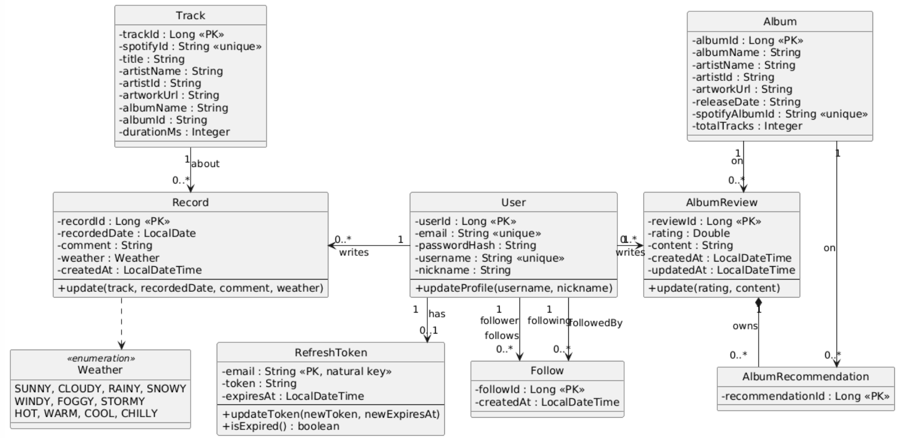

그림 2-1은 시스템의 도메인 엔티티 간 관계를 나타내는 Entity Class Diagram이다.

#### 2.1.1 User

사용자 계정 정보를 관리하는 핵심 엔티티다. Record, AlbumReview, Follow의 소유자로서 시스템 전반에 걸쳐 참조된다.

| Attributes |
|:---|
| −userId:Long «PK» : 사용자 고유 식별자 (auto increment) |
| −email:String «unique» : 로그인에 사용되는 이메일 |
| −passwordHash:String : BCrypt로 암호화된 비밀번호 |
| −username:String «unique» : 프로필 접근 식별자, 변경 불가 |
| −nickname:String : 사용자 표시 이름 |
| **Methods** |
| +updateProfile(username:String, nickname:String) : username과 nickname을 수정한다 |

---

#### 2.1.2 RefreshToken

로그인 시 발급되어 DB에 저장되는 토큰 엔티티다. 이메일을 natural key(PK)로 사용하며, 로그아웃 시 삭제하여 토큰을 무효화한다.

| Attributes |
|:---|
| −email:String «PK, natural key» : 사용자 이메일 (user_email 컬럼) |
| −token:String : Refresh Token 값 |
| −expiresAt:LocalDateTime : 토큰 만료 일시 |
| **Methods** |
| +updateToken(newToken:String, newExpiresAt:LocalDateTime):RefreshToken : 토큰과 만료 일시를 갱신하고 자신을 반환한다 |
| +isExpired():boolean : 현재 시각 기준 만료 여부를 반환한다 |

---

#### 2.1.3 Track

Spotify API로부터 받아온 트랙 정보를 나타내는 독립 엔티티다. 공유 카탈로그 캐시 역할을 하며, spotifyId에 unique 제약을 두어 중복 저장을 방지한다.

| Attributes |
|:---|
| −trackId:Long «PK» : 트랙 고유 식별자 (auto increment) |
| −spotifyId:String «unique» : Spotify Track ID |
| −title:String : 트랙 제목 |
| −artistName:String : 아티스트명 |
| −artistId:String : Spotify Artist ID |
| −artworkUrl:String : 앨범 커버 이미지 URL |
| −albumName:String : 소속 앨범명 |
| −albumId:String : Spotify Album ID |
| −durationMs:Integer : 재생 시간 (밀리초) |

---

#### 2.1.4 Record

사용자가 날짜별로 등록한 음악 기록의 핵심 단위다. User와 Track을 참조하며, JPA Auditing으로 생성 일시를 자동 관리한다.

| Attributes |
|:---|
| −recordId:Long «PK» : 기록 고유 식별자 (auto increment) |
| −recordedDate:LocalDate : 사용자가 지정한 기록 일자 |
| −comment:String : 개인 코멘트 |
| −weather:Weather : 날씨 (enum) |
| −createdAt:LocalDateTime : 실제 저장 일시 (@CreatedDate) |
| **Methods** |
| +update(track:Track, recordedDate:LocalDate, comment:String, weather:Weather) : 기록의 트랙, 날짜, 코멘트, 날씨를 수정한다 |

---

#### 2.1.5 Weather «enumeration»

Record에 종속된 날씨 열거형이다.

| Constants |
|:---|
| SUNNY, CLOUDY, RAINY, SNOWY, WINDY, FOGGY, STORMY, HOT, WARM, COOL, CHILLY |

---

#### 2.1.6 Album

Spotify API로부터 받아온 앨범 정보를 나타내는 독립 엔티티다. Track과 동일하게 공유 카탈로그 캐시 역할을 하며, spotifyAlbumId에 unique 제약을 둔다.

| Attributes |
|:---|
| −albumId:Long «PK» : 앨범 고유 식별자 (auto increment) |
| −albumName:String : 앨범명 |
| −artistName:String : 아티스트명 |
| −artistId:String : Spotify Artist ID |
| −artworkUrl:String : 앨범 커버 이미지 URL |
| −releaseDate:String : 발매일 |
| −spotifyAlbumId:String «unique» : Spotify Album ID |
| −totalTracks:Integer : 앨범 수록곡 수 |

---

#### 2.1.7 AlbumReview

사용자가 특정 앨범에 남기는 평점과 평론을 나타내는 엔티티다. 동일 User-Album 조합에 unique 제약을 가지며, JPA Auditing으로 생성·수정 일시를 자동 관리한다.

| Attributes |
|:---|
| −reviewId:Long «PK» : 리뷰 고유 식별자 (auto increment) |
| −rating:Double : 평점 (0.1 ~ 10.0) |
| −content:String : 평론 텍스트 (nullable) |
| −createdAt:LocalDateTime : 생성 일시 (@CreatedDate) |
| −updatedAt:LocalDateTime : 수정 일시 (@LastModifiedDate) |
| −recommendations:List\<AlbumRecommendation\> : 추천 앨범 목록 (cascade ALL, orphanRemoval) |
| **Methods** |
| +update(rating:Double, content:String) : 평점과 평론을 수정한다 |
| +updateRecommendations(newRecommendations:List\<AlbumRecommendation\>) : 기존 추천 목록을 전부 교체한다 |

---

#### 2.1.8 AlbumRecommendation

AlbumReview에 종속된 추천 앨범 단위다. 리뷰당 최대 3개까지 등록할 수 있으며, 리뷰 삭제 시 함께 삭제된다.

| Attributes |
|:---|
| −recommendationId:Long «PK» : 추천 고유 식별자 (auto increment) |
| −review:AlbumReview : 소속 리뷰 (@ManyToOne LAZY) |
| −album:Album : 추천 대상 앨범 (@ManyToOne EAGER) |

---

#### 2.1.9 Follow

사용자 간 팔로우 관계를 나타내는 엔티티다. follower가 following을 구독하는 단방향 관계이며, JPA Auditing으로 생성 일시를 자동 관리한다.

| Attributes |
|:---|
| −followId:Long «PK» : 팔로우 고유 식별자 (auto increment) |
| −follower:User : 팔로우를 수행하는 사용자 (@ManyToOne LAZY) |
| −following:User : 팔로우 대상 사용자 (@ManyToOne LAZY) |
| −createdAt:LocalDateTime : 팔로우 생성 일시 (@CreatedDate) |

---

### 2.2 Record Class Diagram
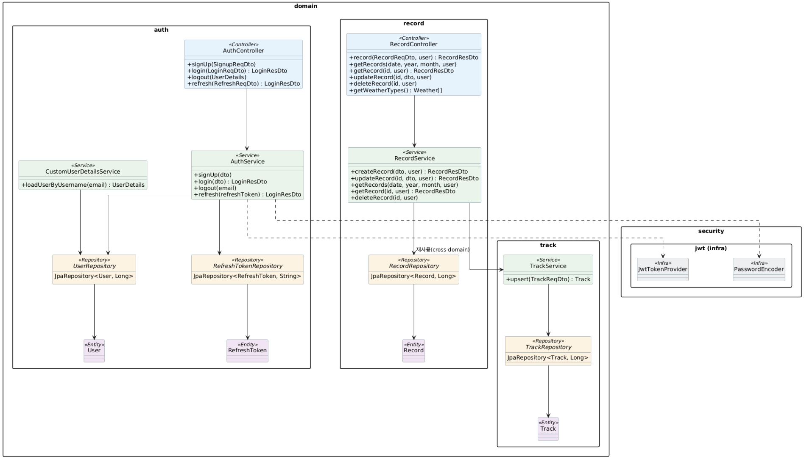

그림 2-2는 인증(auth), 기록(record), 트랙(track) 도메인과 보안(security) 인프라의 계층 구조를 나타내는 Class Diagram이다. Controller → Service → Repository 계층 구조를 따른다.

#### 2.2.1 AuthController «Controller»

인증 관련 HTTP 요청을 처리하는 컨트롤러다.

| Methods |
|:---|
| +signUp(SignupReqDto) : 회원가입 요청을 처리한다 |
| +login(LoginReqDto):LoginResDto : 로그인 요청을 처리하고 JWT를 반환한다 |
| +logout(UserDetails) : 로그아웃 요청을 처리한다 |
| +refresh(RefreshReqDto):LoginResDto : Refresh Token으로 새 토큰을 발급한다 |

---

#### 2.2.2 AuthService «Service»

인증 비즈니스 로직을 담당하는 서비스다.

| Attributes |
|:---|
| −userRepository:UserRepository : 사용자 조회·저장 |
| −passwordEncoder:PasswordEncoder : 비밀번호 암호화·검증 |
| −jwtTokenProvider:JwtTokenProvider : JWT 생성·검증 |
| −refreshTokenRepository:RefreshTokenRepository : Refresh Token 저장·삭제 |
| −jwtProperties:JwtProperties : JWT 설정값 (만료 시간 등) |
| **Methods** |
| +signUp(dto:SignupReqDto) : 이메일·username 중복 검사 후 계정을 생성한다 |
| +login(dto:LoginReqDto):LoginResDto : 인증 후 Access/Refresh Token을 발급한다 |
| +logout(email:String) : Refresh Token을 삭제하여 무효화한다 |
| +refresh(refreshToken:String):LoginResDto : Refresh Token 검증 후 새 토큰을 발급한다 |

---

#### 2.2.3 CustomUserDetailsService «Service»

Spring Security의 UserDetailsService를 구현하여 사용자 인증 정보를 로드하는 서비스다.

| Attributes |
|:---|
| −userRepository:UserRepository : 사용자 조회 |
| **Methods** |
| +loadUserByUsername(email:String):UserDetails : 이메일로 사용자를 조회하여 UserDetails를 반환한다 |

---

#### 2.2.4 UserRepository «Repository»

User 엔티티의 데이터 접근을 담당한다. JpaRepository\<User, Long\>을 확장한다.

| Methods |
|:---|
| +existsByEmail(email:String):Boolean : 이메일 존재 여부를 반환한다 |
| +existsByUsername(username:String):Boolean : username 존재 여부를 반환한다 |
| +findByEmail(email:String):Optional\<User\> : 이메일로 사용자를 조회한다 |
| +findByUsername(username:String):Optional\<User\> : username으로 사용자를 조회한다 |

---

#### 2.2.5 RefreshTokenRepository «Repository»

RefreshToken 엔티티의 데이터 접근을 담당한다. JpaRepository\<RefreshToken, String\>을 확장한다.

| Methods |
|:---|
| +findByEmail(email:String):Optional\<RefreshToken\> : 이메일로 토큰을 조회한다 |
| +deleteByEmail(email:String) : 이메일에 해당하는 토큰을 삭제한다 |

---

#### 2.2.6 RecordController «Controller»

음악 기록 관련 HTTP 요청을 처리하는 컨트롤러다.

| Methods |
|:---|
| +record(RecordReqDto, user):RecordResDto : 새 기록을 생성한다 |
| +getRecords(date:LocalDate, year:Integer, month:Integer, user):List\<RecordResDto\> : 조건별 기록 목록을 조회한다 |
| +getRecord(id:Long, user):RecordResDto : 단건 기록을 조회한다 |
| +updateRecord(id:Long, dto:RecordUpdateReqDto, user):RecordResDto : 기록을 수정한다 |
| +deleteRecord(id:Long, user) : 기록을 삭제한다 |
| +getWeatherTypes():Weather[] : 날씨 enum 목록을 반환한다 |

---

#### 2.2.7 RecordService «Service»

음악 기록 비즈니스 로직을 담당하는 서비스다.

| Attributes |
|:---|
| −recordRepository:RecordRepository : 기록 조회·저장·삭제 |
| −trackService:TrackService : 트랙 upsert (cross-domain 재사용) |
| **Methods** |
| +createRecord(dto:RecordReqDto, user:CustomUserDetails):RecordResDto : 트랙을 upsert하고 기록을 생성한다 |
| +updateRecord(id:Long, dto:RecordUpdateReqDto, user:CustomUserDetails):RecordResDto : 소유자 검증 후 기록을 수정한다 |
| +getRecords(date:LocalDate, year:Integer, month:Integer, user:CustomUserDetails):List\<RecordResDto\> : 날짜·연월 조건으로 기록을 조회한다 |
| +getRecord(id:Long, user:CustomUserDetails):RecordResDto : 단건 기록을 조회한다 |
| +deleteRecord(id:Long, user:CustomUserDetails) : 소유자 검증 후 기록을 삭제한다 |

---

#### 2.2.8 RecordRepository «Repository»

Record 엔티티의 데이터 접근을 담당한다. JpaRepository\<Record, Long\>을 확장한다.

| Methods |
|:---|
| +findByUserAndRecordedDate(user:User, date:LocalDate):List\<Record\> : 특정 날짜의 기록을 조회한다 |
| +findByUser(user:User):List\<Record\> : 사용자의 전체 기록을 조회한다 |
| +countByUser(user:User):long : 사용자의 전체 기록 수를 반환한다 |
| +countByUserAndYearMonth(user:User, year:int, month:int):long : 특정 연월의 기록 수를 반환한다 |
| +findByUserAndYearMonth(user:User, year:int, month:int):List\<Record\> : 특정 연월의 기록을 조회한다 |
| +findTopArtistsByUser(user:User, limit:int):List\<ArtistStatProjection\> : 사용자의 상위 아티스트를 집계한다 |
| +findTopAlbumByUser(user:User, limit:int):List\<AlbumStatProjection\> : 사용자의 상위 앨범을 집계한다 |

---

#### 2.2.9 TrackService «Service»

트랙 저장 로직을 담당하는 서비스다. RecordService에서 cross-domain으로 재사용된다.

| Attributes |
|:---|
| −trackRepository:TrackRepository : 트랙 조회·저장 |
| **Methods** |
| +upsert(dto:TrackReqDto):Track : spotifyId로 기존 트랙을 조회하거나 새로 저장한다 |

---

#### 2.2.10 TrackRepository «Repository»

Track 엔티티의 데이터 접근을 담당한다. JpaRepository\<Track, Long\>을 확장한다.

| Methods |
|:---|
| +findBySpotifyId(spotifyId:String):Optional\<Track\> : Spotify ID로 트랙을 조회한다 |

---

#### 2.2.11 JwtTokenProvider «Infra»

JWT 토큰의 생성, 검증, 파싱을 담당하는 보안 인프라 컴포넌트다. 비밀 키는 환경 변수(JWT_SECRET)로만 주입받는다.

| Attributes |
|:---|
| −jwtProperties:JwtProperties : JWT 설정값 (secret, 만료 시간) |
| −customUserDetailsService:CustomUserDetailsService : 토큰에서 추출한 이메일로 UserDetails 로드 |
| **Methods** |
| +generateAccessToken(email:String):String : Access Token을 생성한다 |
| +generateRefreshToken(email:String):String : Refresh Token을 생성한다 |
| +validateToken(token:String):boolean : 토큰의 유효성을 검증한다 |
| +getAuthentication(token:String):Authentication : 토큰에서 인증 객체를 생성한다 |
| +getEmail(token:String):String : 토큰에서 이메일을 추출한다 |

---

#### 2.2.12 PasswordEncoder «Infra»

Spring Security가 제공하는 비밀번호 암호화 컴포넌트다. SecurityConfig에서 BCryptPasswordEncoder로 빈 등록되며, AuthService에서 회원가입 시 암호화와 로그인 시 비밀번호 검증에 사용된다.

| Methods |
|:---|
| +encode(rawPassword:CharSequence):String : 평문 비밀번호를 BCrypt로 암호화한다 |
| +matches(rawPassword:CharSequence, encodedPassword:String):boolean : 평문과 암호화된 비밀번호를 비교한다 |

---

### 2.3 Review Class Diagram
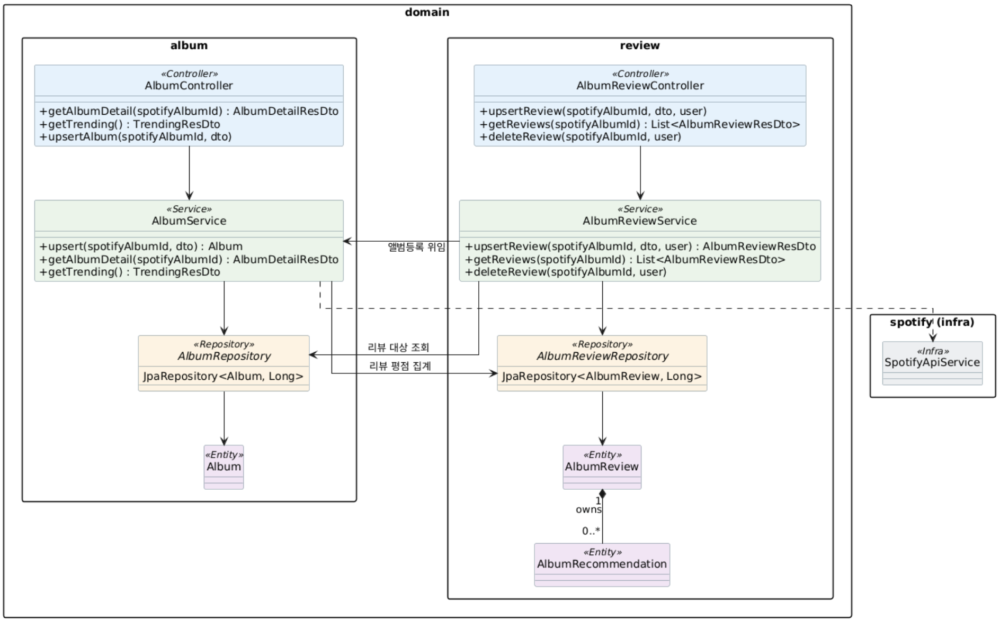

그림 2-3은 앨범(album), 리뷰(review) 도메인과 Spotify 인프라의 계층 구조를 나타내는 Class Diagram이다.

#### 2.3.1 AlbumController «Controller»

앨범 관련 HTTP 요청을 처리하는 컨트롤러다.

| Methods |
|:---|
| +getAlbumDetail(spotifyAlbumId:String):AlbumDetailResDto : 앨범 상세 정보를 조회한다 |
| +getTrending():TrendingResDto : 화제의 앨범 목록을 조회한다 |
| +upsertAlbum(spotifyAlbumId:String, dto:AlbumReqDto) : 앨범을 등록하거나 기존 앨범을 반환한다 |

---

#### 2.3.2 AlbumService «Service»

앨범 비즈니스 로직을 담당하는 서비스다. AlbumReviewService에서 앨범 등록을 위임받는다.

| Attributes |
|:---|
| −albumRepository:AlbumRepository : 앨범 조회·저장 |
| −albumReviewRepository:AlbumReviewRepository : 리뷰 평점 집계 조회 |
| −spotifyApiService:SpotifyApiService : Spotify API 호출 |
| **Methods** |
| +upsert(spotifyAlbumId:String, dto:AlbumReqDto):Album : spotifyAlbumId로 기존 앨범을 조회하거나 새로 저장한다 |
| +getAlbumDetail(spotifyAlbumId:String):AlbumDetailResDto : 앨범 상세 + 평점 요약을 반환한다 |
| +getTrending():TrendingResDto : 최근 30일 기준 화제의 앨범 목록을 반환한다 |

---

#### 2.3.3 AlbumRepository «Repository»

Album 엔티티의 데이터 접근을 담당한다. JpaRepository\<Album, Long\>을 확장한다.

| Methods |
|:---|
| +findBySpotifyAlbumId(spotifyAlbumId:String):Optional\<Album\> : Spotify Album ID로 앨범을 조회한다 |

---

#### 2.3.4 AlbumReviewController «Controller»

앨범 리뷰 관련 HTTP 요청을 처리하는 컨트롤러다.

| Methods |
|:---|
| +upsertReview(spotifyAlbumId:String, dto:AlbumReviewReqDto, user):AlbumReviewResDto : 리뷰를 작성하거나 덮어쓴다 |
| +getReviews(spotifyAlbumId:String):List\<AlbumReviewResDto\> : 앨범의 전체 리뷰 목록을 조회한다 |
| +deleteReview(spotifyAlbumId:String, user) : 본인의 리뷰를 삭제한다 |

---

#### 2.3.5 AlbumReviewService «Service»

앨범 리뷰 비즈니스 로직을 담당하는 서비스다. 앨범 등록은 AlbumService에 위임한다.

| Attributes |
|:---|
| −albumReviewRepository:AlbumReviewRepository : 리뷰 조회·저장·삭제 |
| −albumRepository:AlbumRepository : 리뷰 대상 앨범 조회 |
| −albumService:AlbumService : 앨범 등록 위임 |
| **Methods** |
| +upsertReview(spotifyAlbumId:String, dto:AlbumReviewReqDto, user:CustomUserDetails):AlbumReviewResDto : 기존 리뷰가 있으면 수정, 없으면 새로 생성한다 |
| +getReviews(spotifyAlbumId:String):List\<AlbumReviewResDto\> : 앨범의 전체 리뷰 목록을 조회한다 |
| +deleteReview(spotifyAlbumId:String, user:CustomUserDetails) : 본인 소유 검증 후 리뷰를 삭제한다 |

---

#### 2.3.6 AlbumReviewRepository «Repository»

AlbumReview 엔티티의 데이터 접근을 담당한다. JpaRepository\<AlbumReview, Long\>을 확장한다.

| Methods |
|:---|
| +findReviewsBySpotifyAlbumId(spotifyAlbumId:String):List\<AlbumReview\> : 앨범의 전체 리뷰를 조회한다 |
| +findMyReview(user:User, spotifyAlbumId:String):Optional\<AlbumReview\> : 특정 앨범에 대한 본인 리뷰를 조회한다 |
| +findByUserOrderByCreatedAtDesc(user:User):List\<AlbumReview\> : 사용자의 리뷰를 최신순으로 조회한다 |
| +findTopRatedByUser(user:User, pageable:Pageable):List\<AlbumReview\> : 사용자의 최고 평점 리뷰를 조회한다 |
| +findAvgRatingBySpotifyAlbumId(spotifyAlbumId:String):Double : 앨범의 평균 평점을 반환한다 |
| +countBySpotifyAlbumId(spotifyAlbumId:String):Long : 앨범의 리뷰 수를 반환한다 |
| +findMostReviewed(since:LocalDateTime, pageable:Pageable):List\<MostReviewedProjection\> : 기간 내 리뷰 수 기준 상위 앨범을 집계한다 |
| +findHighestRated(since:LocalDateTime, pageable:Pageable):List\<HighestRatedProjection\> : 기간 내 평균 평점 기준 상위 앨범을 집계한다 |
| +findFollowingFeed(user:User, pageable:Pageable):Page\<AlbumReview\> : 팔로잉 사용자의 최신 리뷰를 조회한다 |
| +findLatestFeed(pageable:Pageable):Page\<AlbumReview\> : 전체 최신 리뷰를 조회한다 |

---

#### 2.3.7 SpotifyApiService «Infra»

Spotify Web API와의 통신을 담당하는 인프라 컴포넌트다. 트랙·앨범 검색과 앨범 상세 조회를 수행한다.

| Attributes |
|:---|
| −spotifyProperties:SpotifyProperties : Spotify API 설정값 |
| −spotifyTokenService:SpotifyTokenService : Spotify Access Token 관리 |
| −restTemplate:RestTemplate : HTTP 통신 |
| **Methods** |
| +searchTracks(query:String):List\<TrackResDto\> : 키워드로 트랙을 검색한다 |
| +searchAlbums(query:String):List\<AlbumResDto\> : 키워드로 앨범을 검색한다 |
| +getAlbumDetail(spotifyAlbumId:String):SpotifyAlbumResDto : Spotify에서 앨범 상세를 조회한다 |

---

## 3. Sequence diagram

### 1) 인증 (Authentication)

#### Sign Up
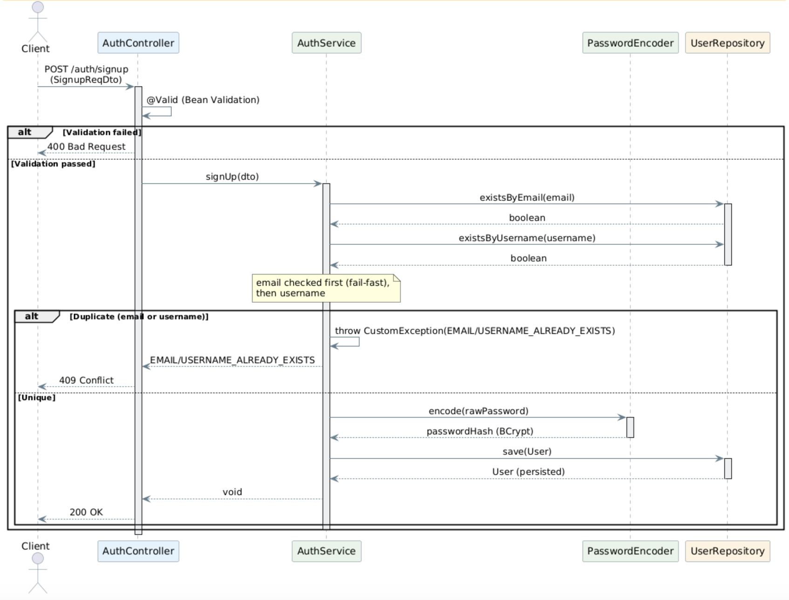

위 그림은 Sign Up(회원가입)의 과정이다. Client가 POST /auth/signup으로 SignupReqDto를 전송하면 AuthController에서 @Valid로 Bean Validation을 수행한다.
유효성 검사에 실패하면 400 Bad Request를 반환한다. 검증을 통과하면 AuthService의 signUp(dto)을 호출하고, AuthService는 UserRepository를 통해 이메일 중복을 먼저 확인한 뒤
username 중복을 확인한다 (fail-fast 방식). 이메일 또는 username이 이미 존재하면 CustomException을 발생시켜 409 Conflict를 반환한다.
두 항목 모두 고유한 경우 PasswordEncoder의 encode()로 비밀번호를 BCrypt 암호화하고, UserRepository의 save()로 User를 DB에 저장한 뒤 200 OK를 반환한다.

#### Login
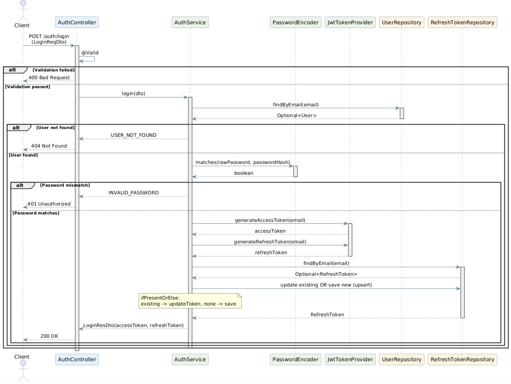

위 그림은 Login(로그인)의 과정이다. Client가 POST /auth/login으로 LoginReqDto를 전송하면 @Valid 검증 후 AuthService의 login(dto)을 호출한다.
AuthService는 UserRepository의 findByEmail()로 사용자를 조회하고, 존재하지 않으면 404 Not Found를 반환한다. 사용자가 존재하면 PasswordEncoder의 matches()로 비밀번호를 검증하고,
불일치 시 401 Unauthorized를 반환한다. 비밀번호가 일치하면 JwtTokenProvider를 통해 Access Token과 Refresh Token을 생성한다. 이후 RefreshTokenRepository에서 기존 토큰을 조회하여,
존재하면 updateToken()으로 갱신하고 없으면 새로 저장하는 upsert 방식으로 처리한다. 최종적으로 LoginResDto(accessToken, refreshToken)를 200 OK로 반환한다.

#### Token Refresh
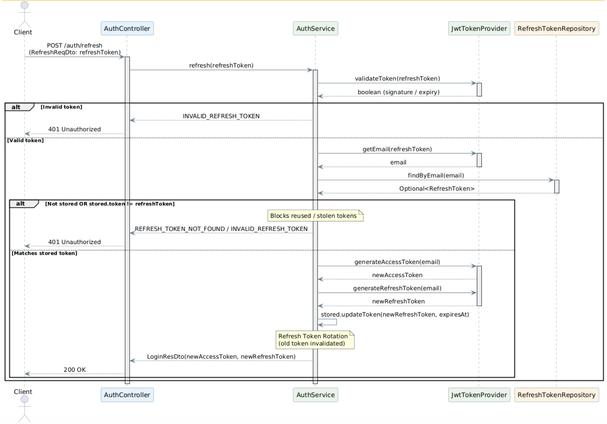

위 그림은 Token Refresh(토큰 갱신)의 과정이다. Client가 POST /auth/refresh로 RefreshReqDto(refreshToken)를 전송하면 AuthService의 refresh()를 호출한다.
AuthService는 JwtTokenProvider의 validateToken()으로 토큰의 서명과 만료를 검증하고, 유효하지 않으면 401 Unauthorized를 반환한다. 토큰이 유효하면 getEmail()로 이메일을 추출하고, 
RefreshTokenRepository에서 저장된 토큰을 조회한다. 저장된 토큰이 없거나 요청된 토큰과 일치하지 않으면 재사용/탈취된 토큰으로 간주하여 401 Unauthorized를 반환한다.
토큰이 일치하면 새로운 Access Token과 Refresh Token을 생성하고, 기존 Refresh Token을 updateToken()으로 갱신하는 Refresh Token Rotation을 수행한 뒤 200 OK로 반환한다.

#### Logout
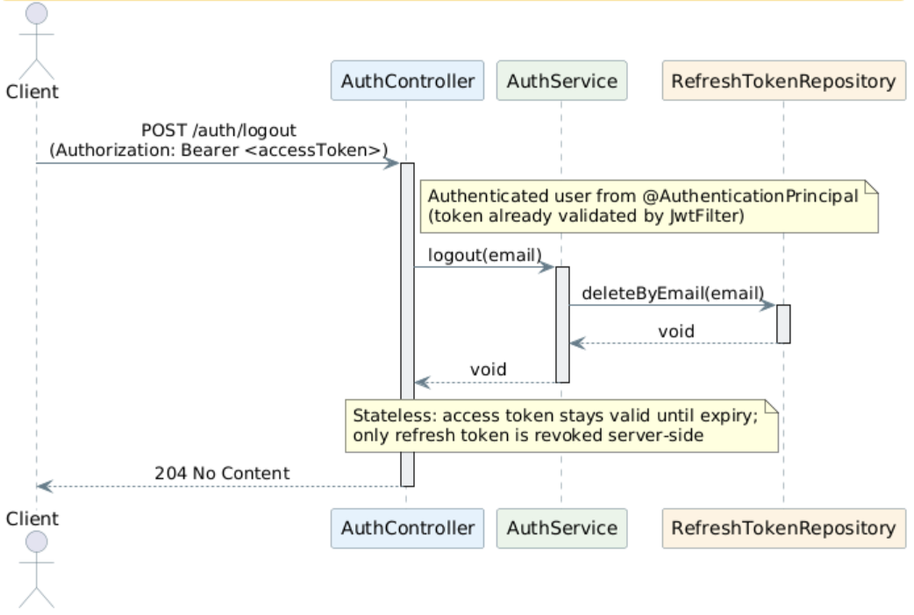

위 그림은 Logout(로그아웃)의 과정이다. Client가 POST /auth/logout으로 요청하면 Authorization 헤더의 Access Token은 JwtFilter에 의해 이미 검증된 상태이며,
@AuthenticationPrincipal로 인증된 사용자 정보를 주입받는다. AuthController는 AuthService의 logout(email)을 호출하고, 
AuthService는 RefreshTokenRepository의 deleteByEmail()로 해당 사용자의 Refresh Token을 DB에서 삭제하여 무효화한다. Stateless 구조이므로 Access Token은 만료 시까지 유효하며, 
서버 측에서는 Refresh Token만 폐기한다. 최종적으로 204 No Content를 반환한다.

#### JWT Filter
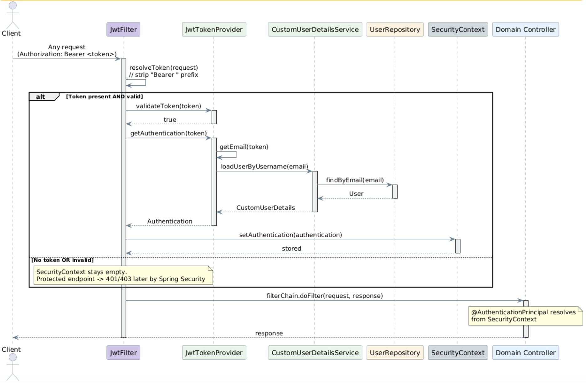

위 그림은 JWT Filter(매 요청 인증 필터)의 과정이다. Client의 모든 요청에 대해 JwtFilter가 먼저 실행되며, resolveToken()으로 Authorization 헤더에서 "Bearer " 접두사를 제거하여 토큰을 추출한다.
토큰이 존재하고 유효한 경우, JwtTokenProvider의 getAuthentication()을 호출하여 토큰에서 이메일을 추출하고, CustomUserDetailsService의 loadUserByUsername()을 통해
UserRepository에서 사용자를 조회하여 CustomUserDetails를 생성한다. 생성된 Authentication 객체를 SecurityContext에 저장하면 이후 
@AuthenticationPrincipal로 사용자 정보를 주입받을 수 있게 된다. 토큰이 없거나 유효하지 않은 경우 SecurityContext를 비워두고, 보호된 엔드포인트 접근 시 Spring Security가 401/403을 반환한다. 
인증 처리 후 filterChain.doFilter()로 다음 필터 또는 Domain Controller에 요청을 전달한다.

---

### 2) 기록 (Record)

#### Create Record
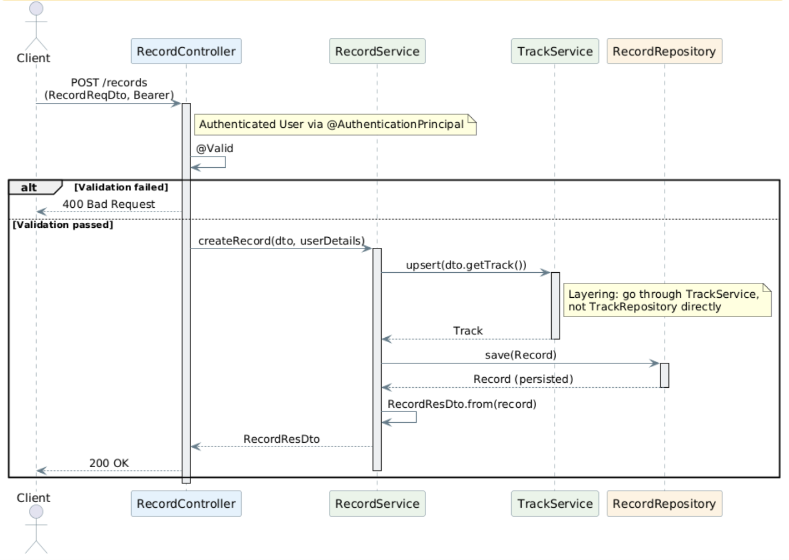

위 그림은 Create Record(기록 생성)의 과정이다. Client가 POST /records로 RecordReqDto와 Bearer 토큰을 전송하면 @AuthenticationPrincipal로 인증된 사용자를 주입받고,
@Valid로 입력값을 검증한다. 유효성 검사에 실패하면 400 Bad Request를 반환한다. 검증을 통과하면 RecordService의 createRecord(dto, userDetails)를 호출한다.
RecordService는 계층 구조를 준수하여 TrackRepository에 직접 접근하지 않고 TrackService의 upsert(dto.getTrack())를 호출하여 트랙을 조회하거나 새로 저장한다. 
이후 반환된 Track과 사용자 정보로 Record를 생성하고 RecordRepository의 save()로 DB에 저장한 뒤, RecordResDto.from(record)로 변환하여 200 OK로 반환한다.

#### Get Records
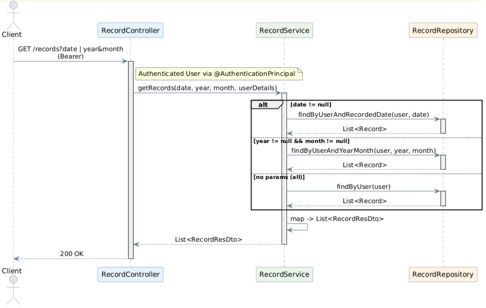

위 그림은 Get Records(기록 목록 조회)의 과정이다. Client가 GET /records에 선택적 쿼리 파라미터(date, year&month)와 Bearer 토큰을 전송하면 
RecordController가 RecordService의 getRecords()를 호출한다. RecordService는 파라미터 조건에 따라 분기 처리한다. date가 존재하면 findByUserAndRecordedDate()로 특정 날짜의 기록을 조회하고,
year와 month가 존재하면 findByUserAndYearMonth()로 해당 연월의 기록을 조회하며, 아무 파라미터도 없으면 findByUser()로 전체 기록을 조회한다.
조회된 Record 목록을 List\<RecordResDto\>로 변환하여 200 OK로 반환한다.

#### Get Record
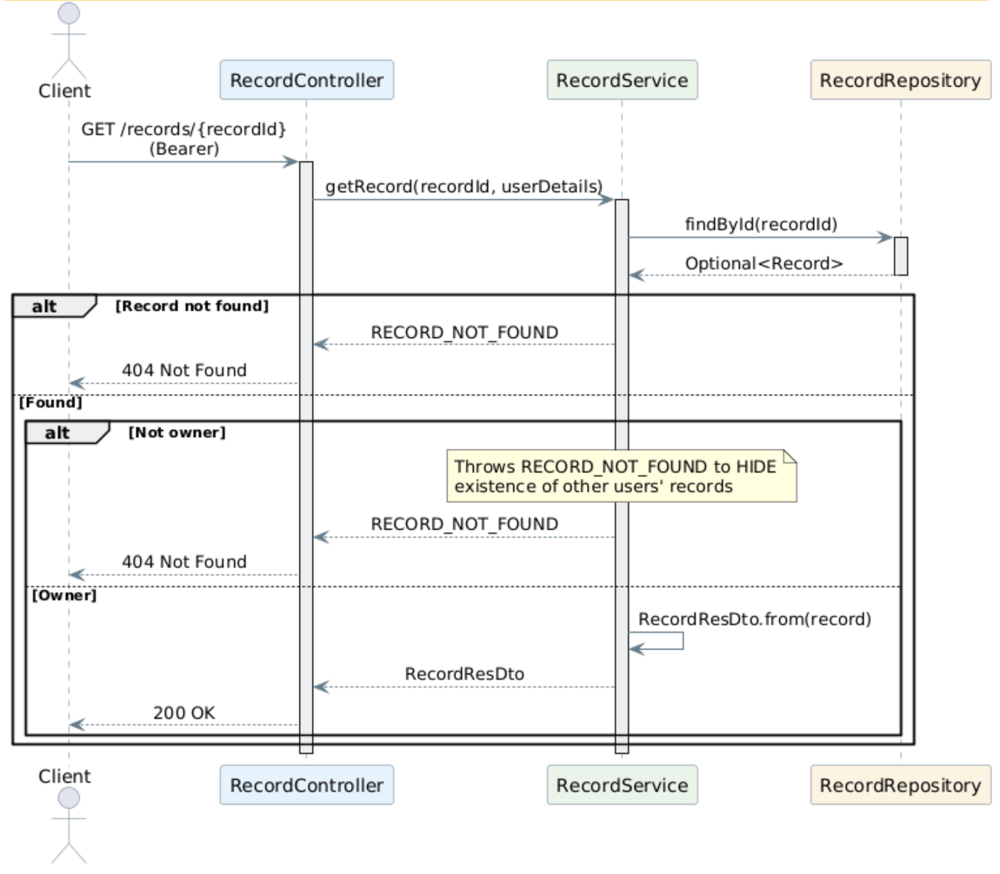

위 그림은 Get Record(단건 기록 조회)의 과정이다. Client가 GET /records/{recordId}로 요청하면 RecordService의 getRecord()를 호출한다.
RecordService는 RecordRepository의 findById()로 기록을 조회하고, 기록이 존재하지 않으면 RECORD_NOT_FOUND 예외로 404 Not Found를 반환한다. 
기록이 존재하지만 소유자가 아닌 경우에도 다른 사용자의 기록 존재 여부를 숨기기 위해 동일하게 RECORD_NOT_FOUND 예외로 404 Not Found를 반환한다. 
소유자 검증을 통과하면 RecordResDto.from(record)로 변환하여 200 OK로 반환한다.

#### Update Record
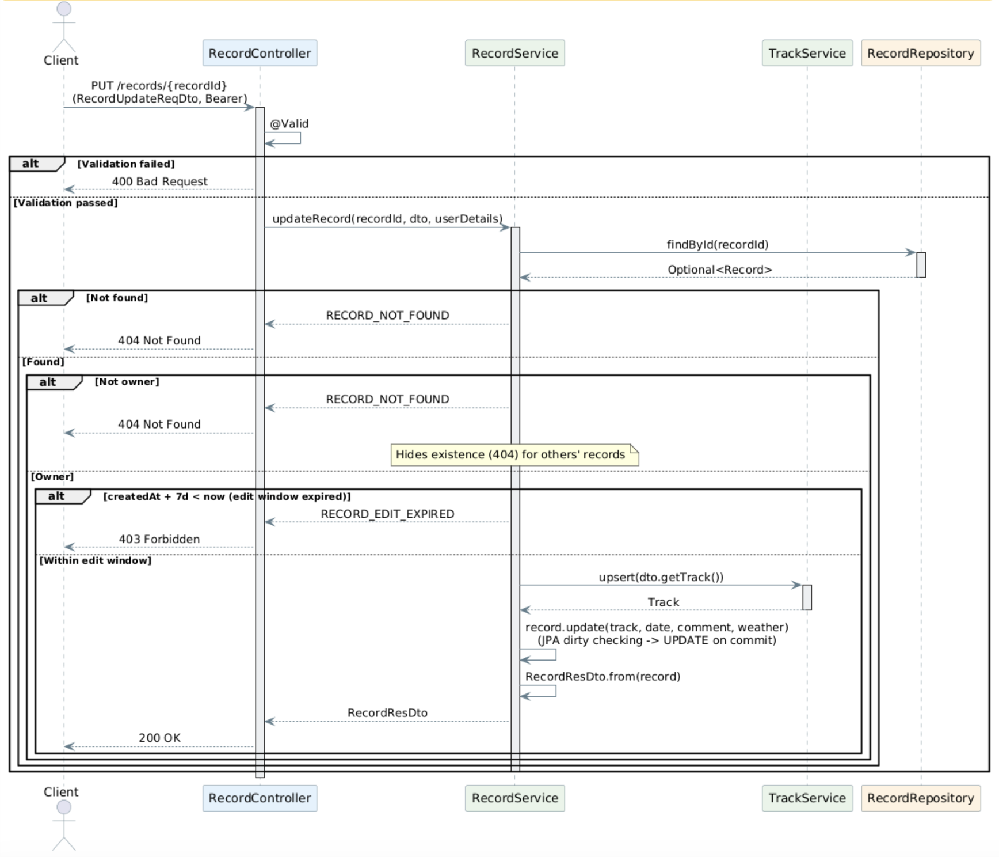

위 그림은 Update Record(기록 수정)의 과정이다. Client가 PUT /records/{recordId}로 RecordUpdateReqDto를 전송하면 @Valid 검증 후 RecordService의 updateRecord()를 호출한다.
RecordService는 findById()로 기록을 조회하고, 기록이 존재하지 않거나 소유자가 아닌 경우 RECORD_NOT_FOUND 404를 반환한다. 소유자인 경우 수정 가능 기간(생성 후 7일 이내)을 확인하고, 
기간이 만료되었으면 RECORD_EDIT_EXPIRED 403 Forbidden을 반환한다. 수정 가능 기간 내라면 TrackService의 upsert()로 트랙을 처리하고,
record.update(track, date, comment, weather)로 엔티티를 수정한다. JPA dirty checking에 의해 트랜잭션 커밋 시 자동으로 UPDATE가 실행되며, 수정된 RecordResDto를 200 OK로 반환한다.

#### Delete Record
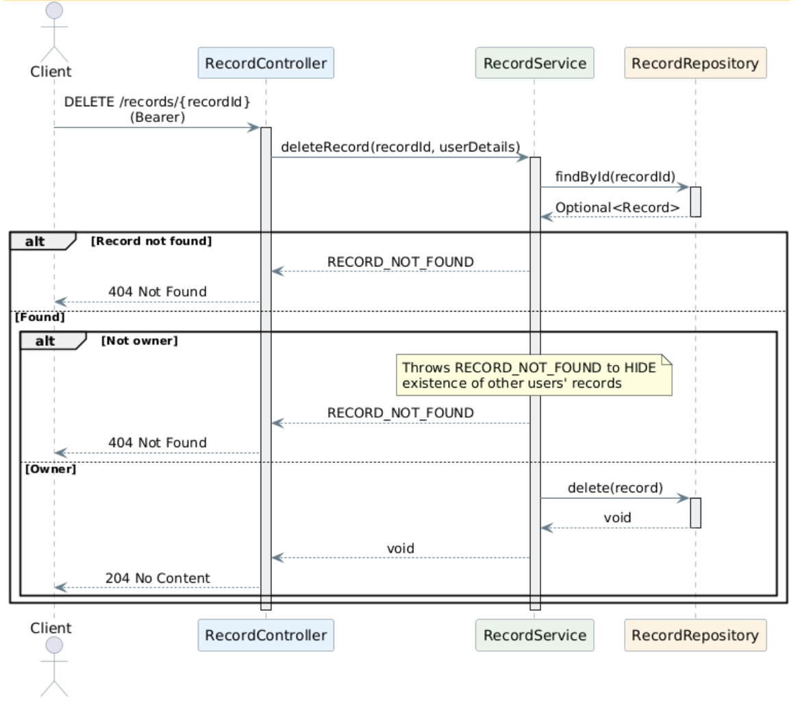

위 그림은 Delete Record(기록 삭제)의 과정이다. Client가 DELETE /records/{recordId}로 요청하면 RecordService의 deleteRecord()를 호출한다.
RecordService는 findById()로 기록을 조회하고, 기록이 존재하지 않거나 소유자가 아닌 경우 RECORD_NOT_FOUND 404를 반환하여 다른 사용자의 기록 존재 여부를 숨긴다.
소유자 검증을 통과하면 RecordRepository의 delete(record)로 DB에서 삭제하고 204 No Content를 반환한다.

---

### 3) 리뷰 (Album & Review)

#### Search Album
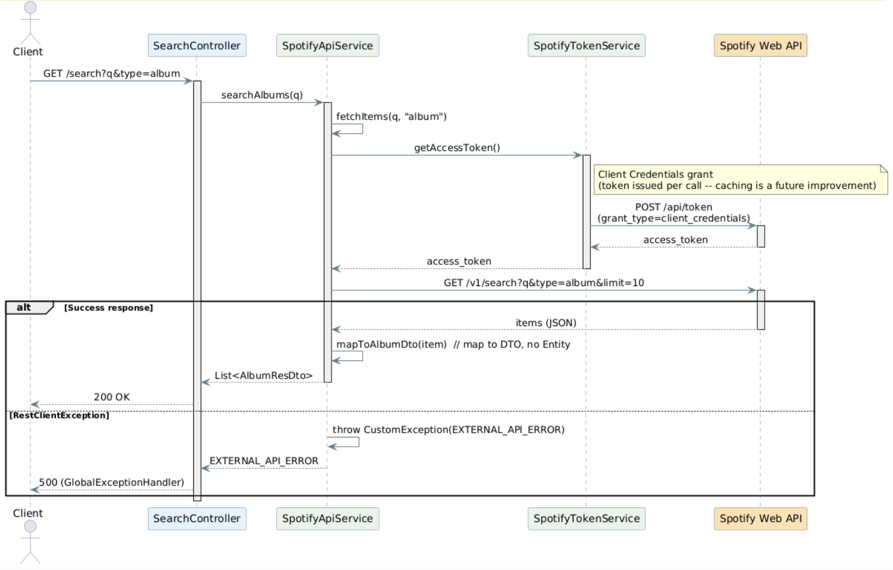

위 그림은 Search Album(앨범 검색)의 과정이다. Client가 GET /search?q&type=album으로 요청하면 SearchController가 SpotifyApiService의 searchAlbums(q)를 호출한다. 
SpotifyApiService는 내부적으로 fetchItems(q, "album")을 실행하며, SpotifyTokenService의 getAccessToken()을 통해 Client Credentials grant 방식으로 Spotify Access Token을 발급받는다.
발급받은 토큰으로 Spotify Web API의 GET /v1/search?q&type=album&limit=10을 호출한다. 성공 응답 시 JSON items를 mapToAlbumDto()로 DTO로 변환하여
List\<AlbumResDto\>를 200 OK로 반환한다. Spotify API 호출 중 RestClientException이 발생하면 CustomException(EXTERNAL_API_ERROR)을 발생시켜 GlobalExceptionHandler가 500을 반환한다.

#### View Album Detail
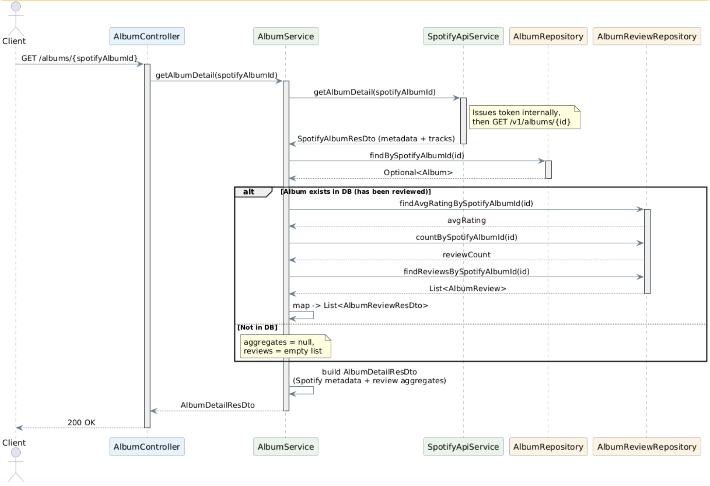

위 그림은 View Album Detail(앨범 상세 조회)의 과정이다. Client가 GET /albums/{spotifyAlbumId}로 요청하면 AlbumController가 AlbumService의 getAlbumDetail()을 호출한다.
AlbumService는 SpotifyApiService의 getAlbumDetail()로 Spotify에서 앨범 메타데이터와 수록곡 정보를 조회한 뒤,
AlbumRepository의 findBySpotifyAlbumId()로 내부 DB에 해당 앨범이 존재하는지 확인한다. 앨범이 DB에 존재하는 경우(리뷰가 등록된 적 있는 경우) AlbumReviewRepository를 통해 
평균 평점(findAvgRatingBySpotifyAlbumId), 리뷰 수(countBySpotifyAlbumId), 리뷰 목록(findReviewsBySpotifyAlbumId)을 조회한다. 앨범이 DB에 없는 경우 집계값은 null,
리뷰 목록은 빈 리스트로 설정한다. 최종적으로 Spotify 메타데이터와 리뷰 집계를 합쳐 AlbumDetailResDto를 200 OK로 반환한다.

#### Upsert Album
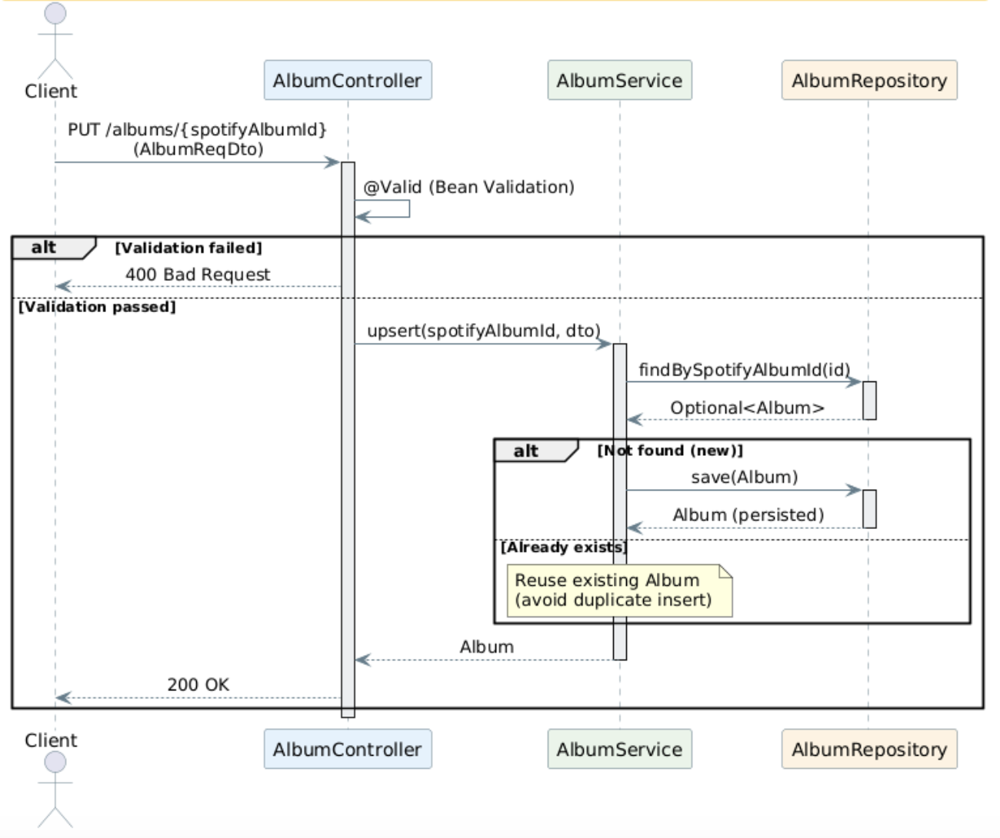

위 그림은 Upsert Album(앨범 등록)의 과정이다. Client가 PUT /albums/{spotifyAlbumId}로 AlbumReqDto를 전송하면 @Valid 검증 후 AlbumService의 upsert()를 호출한다. 
AlbumService는 AlbumRepository의 findBySpotifyAlbumId()로 기존 앨범을 조회한다. 존재하지 않으면 save()로 새 Album을 DB에 저장하고, 
이미 존재하면 중복 저장을 방지하기 위해 기존 Album을 그대로 재사용한다. 최종적으로 Album을 반환하며 200 OK를 응답한다.

#### Upsert Review
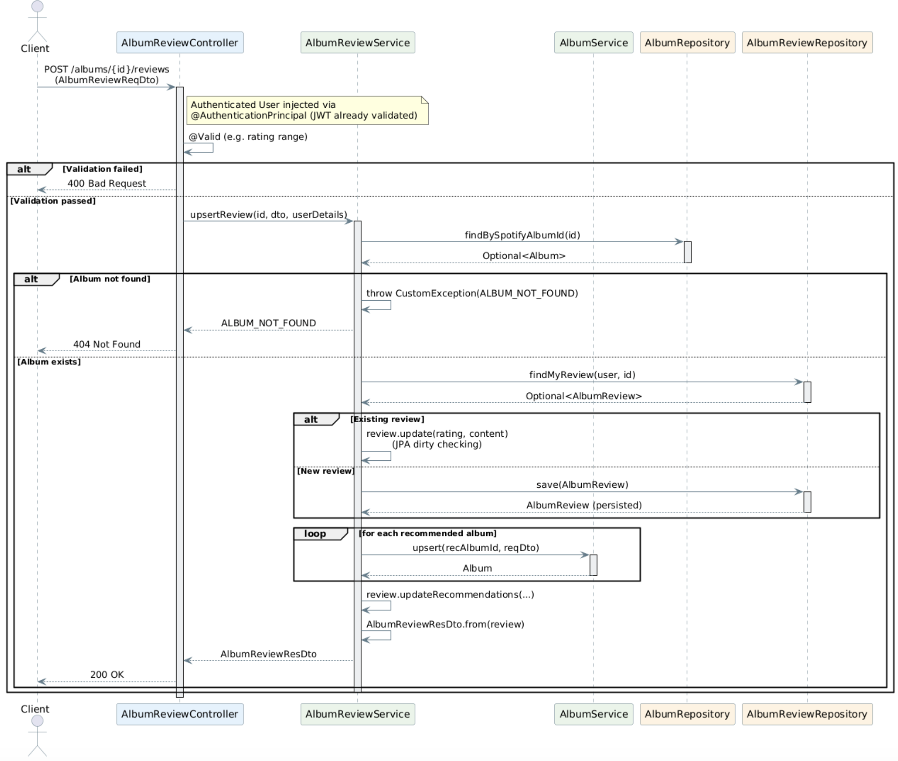

위 그림은 Upsert Review(리뷰 작성/수정)의 과정이다. Client가 POST /albums/{id}/reviews로 AlbumReviewReqDto를 전송하면 @AuthenticationPrincipal로 인증된 사용자를 주입받고
@Valid로 평점 범위 등을 검증한다. AlbumReviewService의 upsertReview()를 호출하면, AlbumRepository의 findBySpotifyAlbumId()로 대상 앨범을 조회하고 없으면 ALBUM_NOT_FOUND 404를 반환한다.
앨범이 존재하면 AlbumReviewRepository의 findMyReview()로 기존 리뷰를 확인한다. 기존 리뷰가 있으면 review.update(rating, content)로 JPA dirty checking을 통해 수정하고,
없으면 save()로 새로 생성한다. 이후 추천 앨범이 있을 경우 loop를 통해 각 추천 앨범을 AlbumService의 upsert()로 등록하고, review.updateRecommendations()로 기존 추천 목록을 전체 교체한다. 
최종적으로 AlbumReviewResDto를 200 OK로 반환한다.

#### Get Review
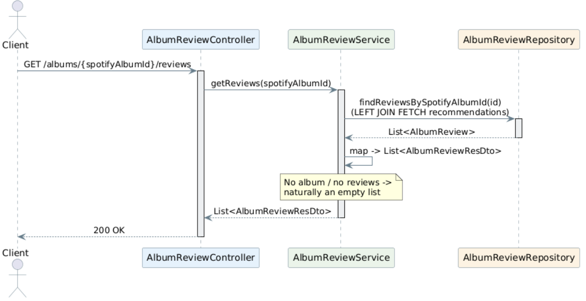

위 그림은 Get Review(리뷰 목록 조회)의 과정이다. Client가 GET /albums/{spotifyAlbumId}/reviews로 요청하면 AlbumReviewController가 AlbumReviewService의 getReviews()를 호출한다. 
AlbumReviewService는 AlbumReviewRepository의 findReviewsBySpotifyAlbumId()를 실행하며, 이 쿼리는 LEFT JOIN FETCH로 추천 앨범을 함께 로딩한다. 
조회된 AlbumReview 목록을 List\<AlbumReviewResDto\>로 변환하여 반환한다. 해당 앨범에 리뷰가 없거나 앨범 자체가 DB에 없는 경우 자연스럽게 빈 리스트를 200 OK로 반환한다.

#### Delete Review
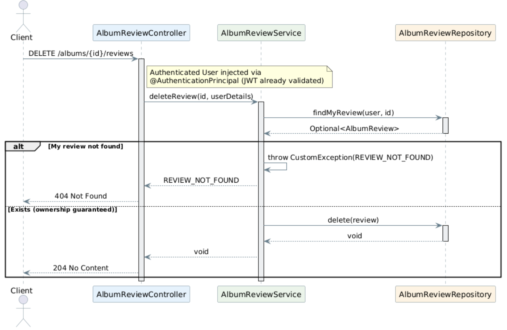

위 그림은 Delete Review(리뷰 삭제)의 과정이다. Client가 DELETE /albums/{id}/reviews로 요청하면 @AuthenticationPrincipal로 인증된 사용자를 주입받고
AlbumReviewService의 deleteReview()를 호출한다. AlbumReviewService는 AlbumReviewRepository의 findMyReview(user, id)로 해당 앨범에 대한 본인 리뷰를 조회한다.
본인 리뷰가 존재하지 않으면 REVIEW_NOT_FOUND 404를 반환한다.
리뷰가 존재하면(소유권이 보장된 상태) delete(review)로 삭제하며, orphanRemoval 설정에 의해 연결된 AlbumRecommendation도 함께 삭제된다. 최종적으로 204 No Content를 반환한다.

---

### 4) 피드 (Feed)

#### Get Feed
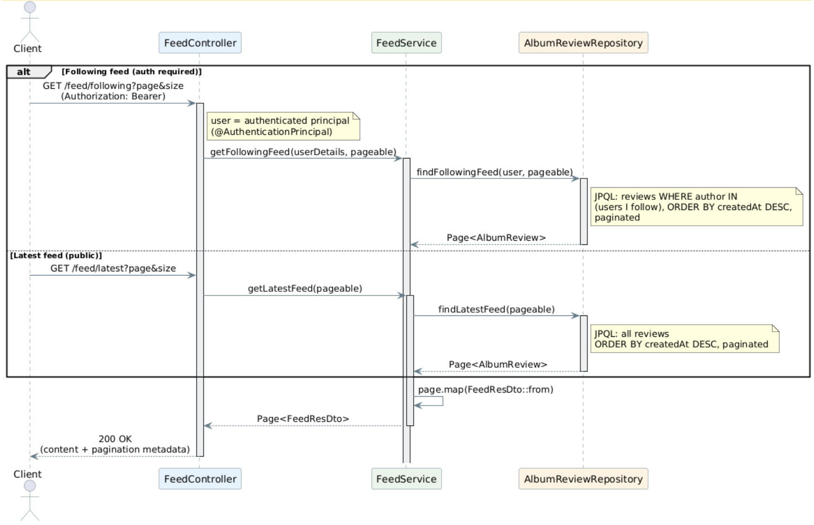

위 그림은 Get Feed(피드 조회)의 과정이다. 피드는 두 가지 유형으로 제공된다. 첫 번째는 Following Feed(팔로잉 피드)로, Client가 GET /feed/following?page&size와 Bearer 토큰으로 요청하면
@AuthenticationPrincipal로 인증된 사용자를 주입받고 FeedService의 getFollowingFeed()를 호출한다. FeedService는 AlbumReviewRepository의 findFollowingFeed()를 실행하며, 
JPQL로 현재 사용자가 팔로우하는 사용자들의 리뷰를 createdAt DESC로 정렬하여 페이징 조회한다. 두 번째는 Latest Feed(최신 피드)로, Client가 GET /feed/latest?page&size로 요청하면 인증 없이
getLatestFeed()를 호출하여 전체 리뷰를 최신순으로 페이징 조회한다.
두 유형 모두 조회된 Page\<AlbumReview\>를 page.map(FeedResDto::from)으로 변환하여 Page\<FeedResDto\>를 200 OK로 반환하며, 응답에는 content와 pagination metadata가 포함된다.

---

### 5) 트렌딩 (Trending)

#### Get Trending
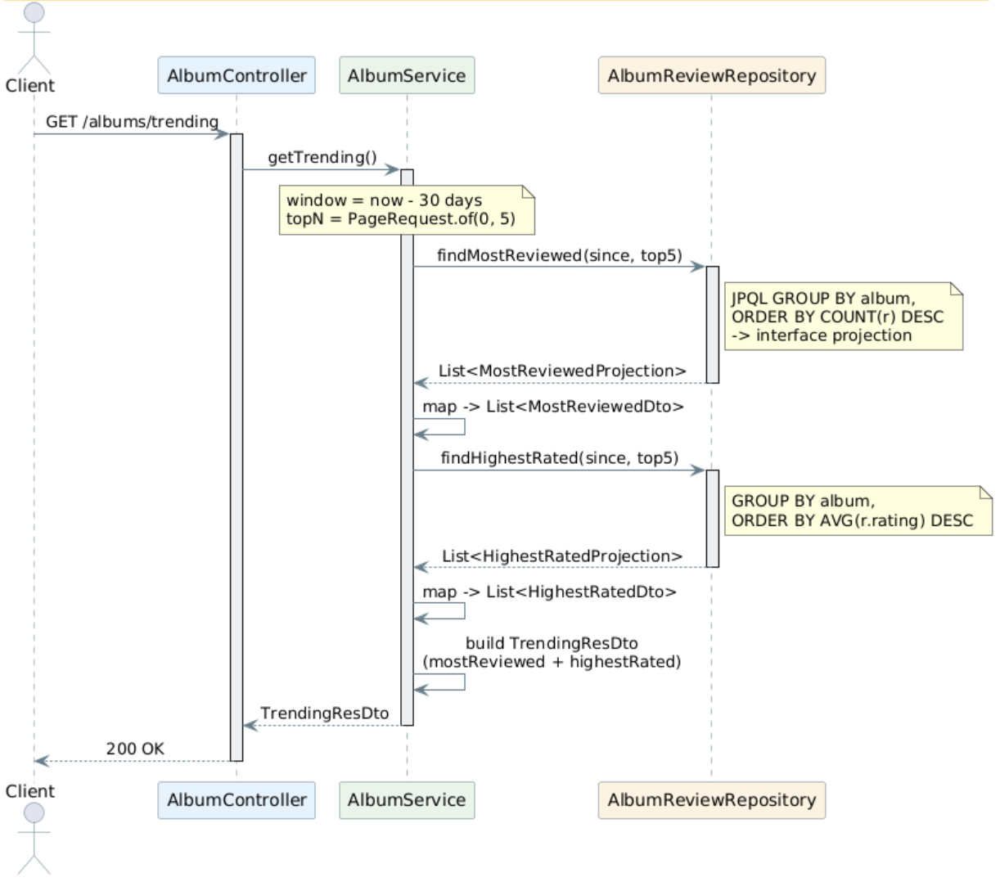

위 그림은 Get Trending(화제의 앨범 조회)의 과정이다. Client가 GET /albums/trending으로 요청하면 AlbumController가 AlbumService의 getTrending()을 호출한다.
AlbumService는 조회 기간을 현재 시각 기준 30일 전으로 설정하고 상위 5개를 가져오기 위한 PageRequest.of(0, 5)를 준비한다. 
먼저 AlbumReviewRepository의 findMostReviewed(since, top5)를 호출하여 JPQL GROUP BY album, ORDER BY COUNT(r) DESC로 리뷰 수 기준 상위 앨범을 집계하고
, 결과를 MostReviewedDto 목록으로 변환한다. 이어서 findHighestRated(since, top5)를 호출하여 GROUP BY album, ORDER BY AVG(r.rating) DESC로 평균 평점 기준 상위 앨범을 집계하고
HighestRatedDto 목록으로 변환한다. 최종적으로 두 목록을 합쳐 TrendingResDto를 200 OK로 반환한다.

---

### 6) 프로필 (Profile)

#### Get My Profile
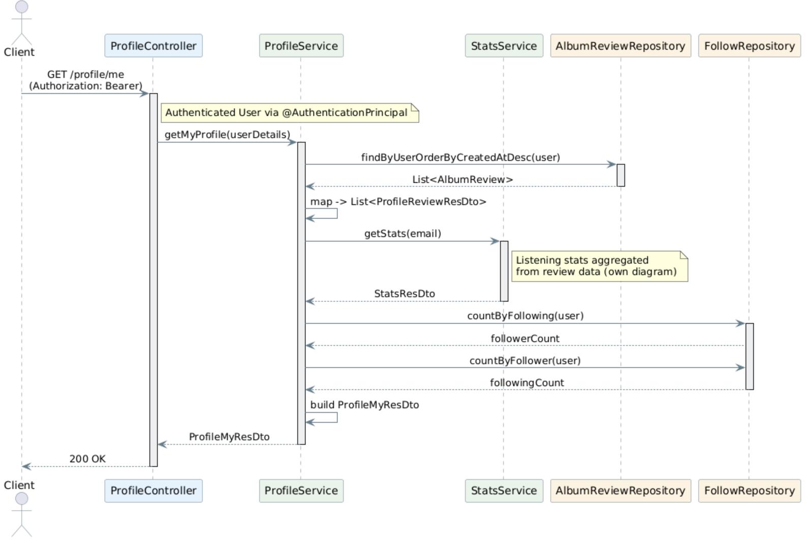

위 그림은 Get My Profile(내 프로필 조회)의 과정이다. Client가 GET /profile/me와 Bearer 토큰으로 요청하면 @AuthenticationPrincipal로 인증된 사용자를 주입받고
ProfileService의 getMyProfile()을 호출한다. ProfileService는 먼저 AlbumReviewRepository의 findByUserOrderByCreatedAtDesc()로 본인의 리뷰 목록을 최신순으로 조회하여
ProfileReviewResDto 목록으로 변환한다. 이어서 StatsService의 getStats(email)을 호출하여 청취 통계(전체·월별 기록 수, 상위 아티스트, 상위 앨범 등)를 집계한다.
마지막으로 FollowRepository의 countByFollowing()과 countByFollower()로 팔로워 수와 팔로잉 수를 조회한다. 이 모든 데이터를 합쳐 ProfileMyResDto를 200 OK로 반환한다. 
내 프로필에서만 통계 정보가 포함된다.

#### Update Profile
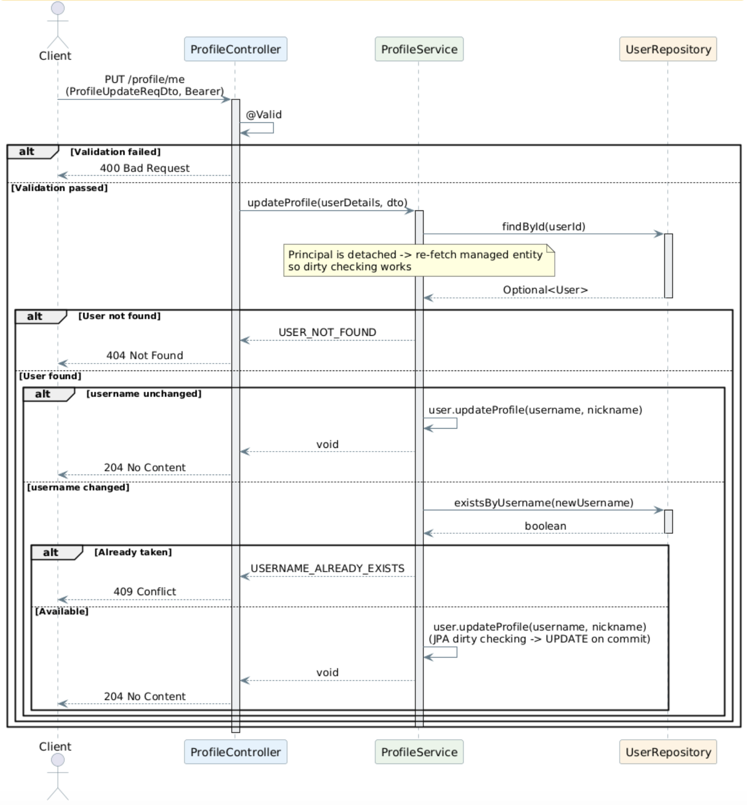

위 그림은 Update Profile(프로필 수정)의 과정이다. Client가 PUT /profile/me로 ProfileUpdateReqDto를 전송하면 @Valid 검증 후 ProfileService의 updateProfile()을 호출한다.
ProfileService는 UserRepository의 findById()로 managed 엔티티를 다시 조회한다 (Principal은 detached 상태이므로 dirty checking을 위해 재조회). 
사용자가 존재하지 않으면 USER_NOT_FOUND 404를 반환한다. 사용자가 존재하면 username 변경 여부를 확인한다. username이 변경되지 않은 경우 바로 user.updateProfile()을 호출하여
204 No Content를 반환한다. username이 변경된 경우 UserRepository의 existsByUsername()으로 중복을 확인하고, 이미 사용 중이면 USERNAME_ALREADY_EXISTS 409 Conflict를 반환한다. 
사용 가능한 username이면 user.updateProfile()을 호출하고 JPA dirty checking으로 UPDATE가 실행되어 204 No Content를 반환한다.

#### Get Profile
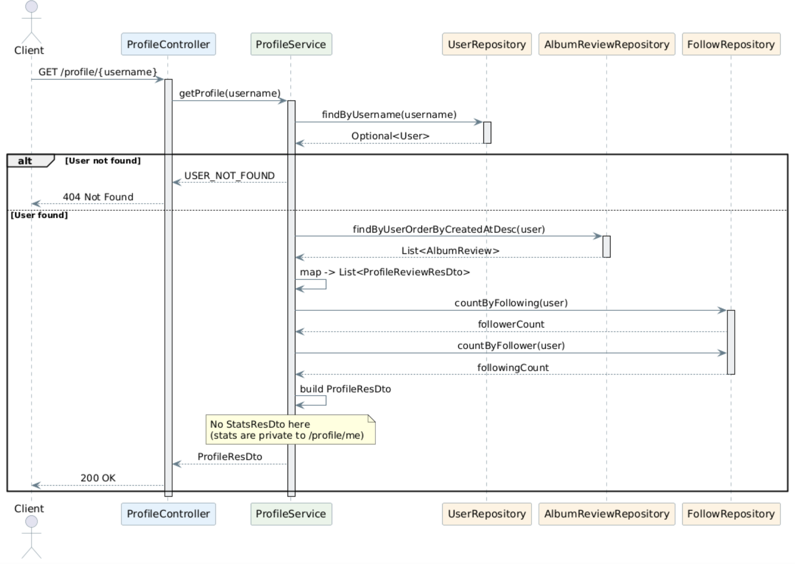

위 그림은 Get Profile(타인 프로필 조회)의 과정이다. Client가 GET /profile/{username}으로 요청하면 ProfileService의 getProfile()을 호출한다. 
ProfileService는 UserRepository의 findByUsername()으로 대상 사용자를 조회하고, 존재하지 않으면 USER_NOT_FOUND 404를 반환한다. 
사용자가 존재하면 AlbumReviewRepository의 findByUserOrderByCreatedAtDesc()로 리뷰 목록을 조회하여 ProfileReviewResDto 목록으로 변환하고,
FollowRepository의 countByFollowing()과 countByFollower()로 팔로워·팔로잉 수를 조회한다. 내 프로필과 달리 StatsResDto는 포함하지 않으며(통계는 /profile/me에서만 제공), 
ProfileResDto를 200 OK로 반환한다.

---

### 7) 통계 (Stats)

#### Get Stats
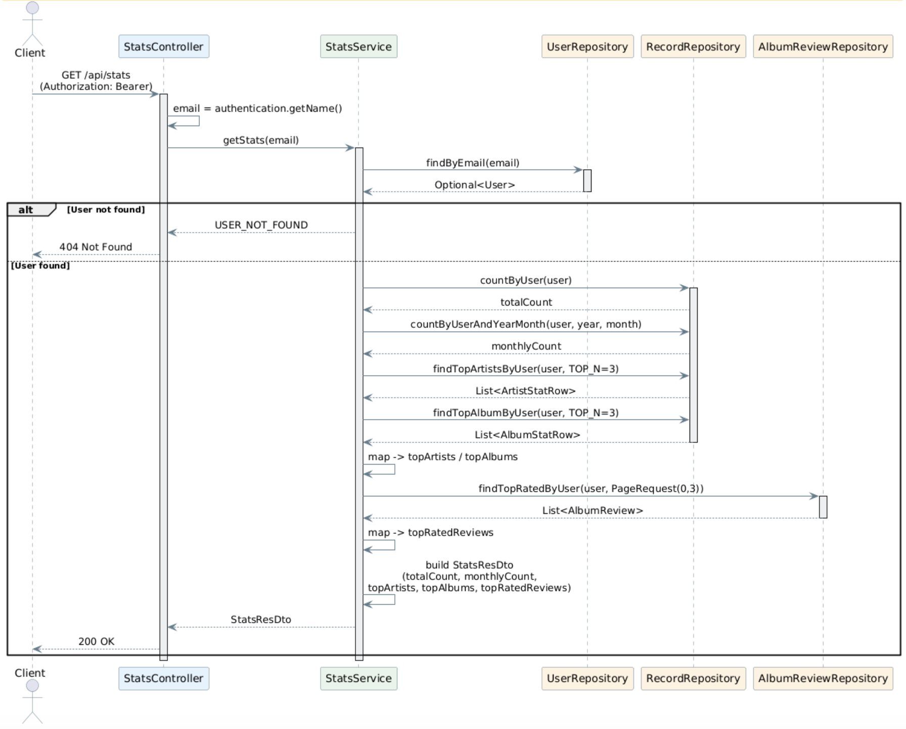

위 그림은 Get Stats(통계 조회)의 과정이다. Client가 GET /api/stats와 Bearer 토큰으로 요청하면 StatsController가 Authentication에서 email을 추출하여 
StatsService의 getStats(email)을 호출한다. StatsService는 UserRepository의 findByEmail()로 사용자를 조회하고, 존재하지 않으면 USER_NOT_FOUND 404를 반환한다. 
사용자가 존재하면 RecordRepository를 통해 다음 통계를 집계한다: countByUser()로 전체 기록 수, countByUserAndYearMonth()로 이번 달 기록 수, 
findTopArtistsByUser(user, TOP_N=3)로 가장 많이 들은 아티스트 Top 3, findTopAlbumByUser(user, TOP_N=3)로 가장 많이 들은 앨범 Top 3을 조회한다. 
이어서 AlbumReviewRepository의 findTopRatedByUser(user, PageRequest(0,3))로 본인이 가장 높은 평점을 준 리뷰 Top 3을 조회한다. 
모든 집계 결과를 합쳐 StatsResDto(totalCount, monthlyCount, topArtists, topAlbums, topRatedReviews)를 200 OK로 반환한다.

---

### 8) 팔로우 (Follow)

#### Follow
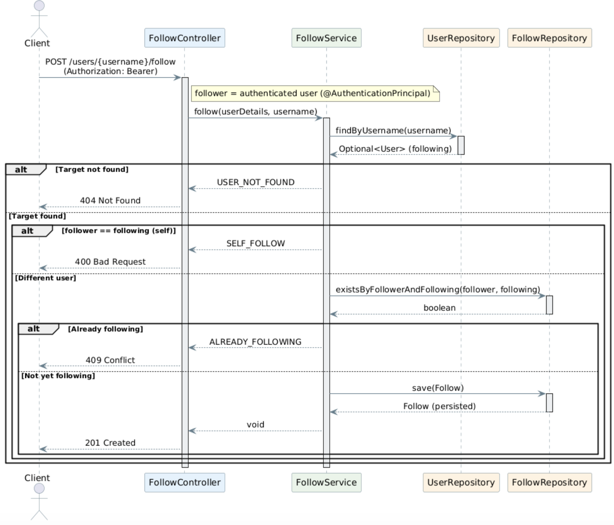

위 그림은 Follow(팔로우)의 과정이다. Client가 POST /users/{username}/follow와 Bearer 토큰으로 요청하면 @AuthenticationPrincipal로 인증된 사용자(follower)를 주입받고
FollowService의 follow()를 호출한다. FollowService는 UserRepository의 findByUsername()으로 대상 사용자(following)를 조회하고, 존재하지 않으면 USER_NOT_FOUND 404를 반환한다. 
대상이 존재하면 follower와 following이 동일한지 확인하고, 자기 자신이면 SELF_FOLLOW 400 Bad Request를 반환한다. 다른 사용자인 경우 
FollowRepository의 existsByFollowerAndFollowing()으로 기존 팔로우 관계를 확인하고, 이미 팔로우 중이면 ALREADY_FOLLOWING 409 Conflict를 반환한다. 
아직 팔로우하지 않은 경우 save(Follow)로 팔로우 관계를 저장하고 201 Created를 반환한다.

#### Unfollow
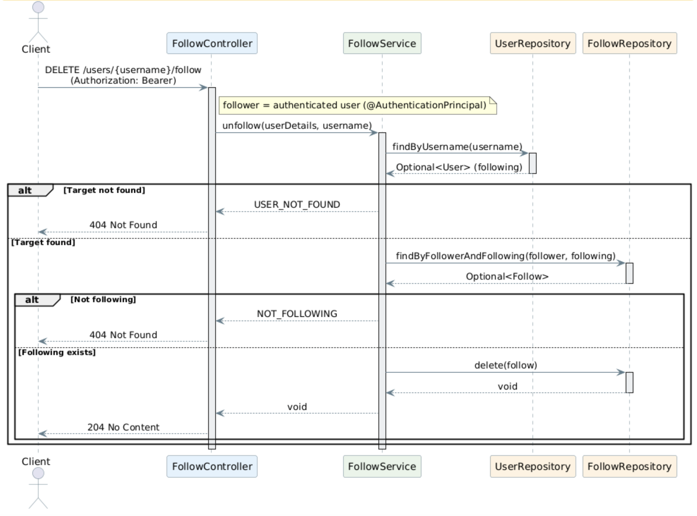

위 그림은 Unfollow(언팔로우)의 과정이다. Client가 DELETE /users/{username}/follow와 Bearer 토큰으로 요청하면 @AuthenticationPrincipal로 인증된 사용자(follower)를 주입받고 
FollowService의 unfollow()를 호출한다. FollowService는 UserRepository의 findByUsername()으로 대상 사용자를 조회하고, 존재하지 않으면 USER_NOT_FOUND 404를 반환한다. 
대상이 존재하면 FollowRepository의 findByFollowerAndFollowing()으로 팔로우 관계를 조회하고, 팔로우 관계가 없으면 NOT_FOLLOWING 404를 반환한다. 
팔로우 관계가 존재하면 delete(follow)로 DB에서 삭제하고 204 No Content를 반환한다.

#### Get Follow List
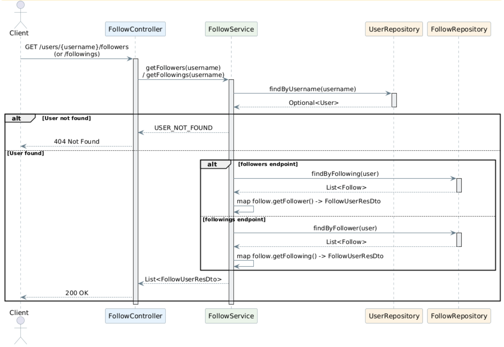

위 그림은 Get Follow List(팔로워·팔로잉 목록 조회)의 과정이다.
Client가 GET /users/{username}/followers 또는 GET /users/{username}/followings로 요청하면 FollowController가 FollowService의 getFollowers() 또는 getFollowings()를 호출한다.
FollowService는 UserRepository의 findByUsername()으로 대상 사용자를 조회하고, 존재하지 않으면 USER_NOT_FOUND 404를 반환한다. 
사용자가 존재하면 팔로워 조회 시 FollowRepository의 findByFollowing(user)으로 해당 사용자를 팔로우하는 Follow 목록을 가져와 follow.getFollower()로 FollowUserResDto를 생성하고, 
팔로잉 조회 시 findByFollower(user)로 해당 사용자가 팔로우하는 Follow 목록을 가져와 follow.getFollowing()으로 FollowUserResDto를 생성한다. 
최종적으로 List\<FollowUserResDto\>를 200 OK로 반환한다.

---

## 4. State machine diagram
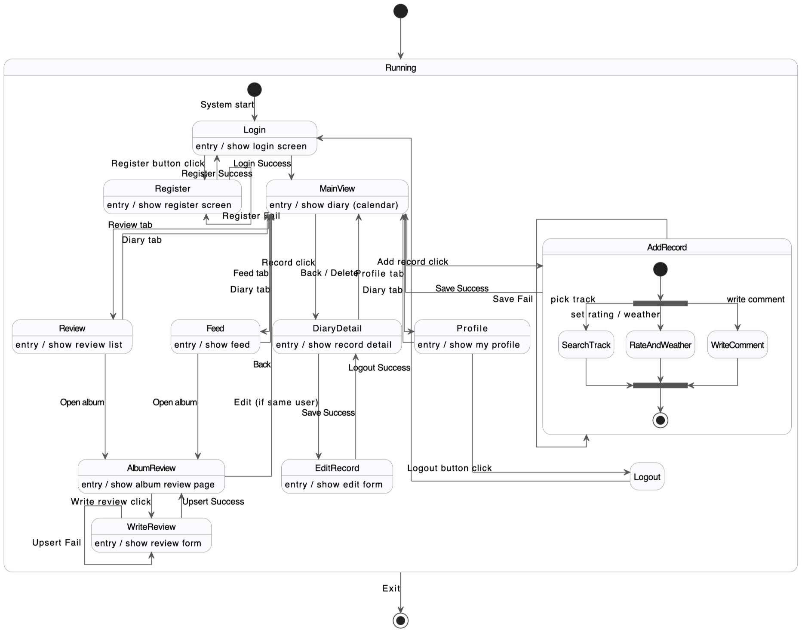

그림 4-1은 MusicJournal 클라이언트의 화면 상태 전이를 나타내는 State Machine Diagram이다.
시스템이 시작되면 로그인 화면이 표시된다. 사용자가 계정이 없으면 회원가입 화면으로 이동하여 계정을 생성한 뒤 로그인 화면으로 돌아오고, 로그인에 성공하면 일기 캘린더(MainView)로 진입한다. 
MainView에서는 하단 탭을 통해 평론(Review), 피드(Feed), 프로필(Profile) 화면으로 이동할 수 있으며, 특정 기록을 선택하면 상세 화면(DiaryDetail)으로 이동하여 수정 또는 삭제할 수 있다
(수정은 본인 기록인 경우에만 가능). 기록 추가 버튼을 누르면 AddRecord 복합 상태로 진입하여 트랙 검색(SearchTrack), 날씨 설정(RateAndWeather), 코멘트 작성(WriteComment)을 순서에 관계없이 완료한 뒤
저장하면 MainView로 복귀한다. 평론 탭이나 피드에서 앨범을 선택하면 앨범 평론 페이지(AlbumReview)로 이동하고, 여기서 평론 작성 폼(WriteReview)을 열어 리뷰를 작성하거나 수정할 수 있다. 
프로필 화면에서 로그아웃 버튼을 누르면 로그인 화면으로 돌아가며, 앱을 종료하면 시스템이 최종 종료 상태에 도달한다.

---

## 5. Implementation requirements

**S/W Requirements**

(1) Java 21+

(2) Spring Boot 4.0+

(3) MySQL 8.0+

**H/W Requirements**

(1) CPU : Apple M5 (개발 환경 기준)

(2) RAM : 8 GB+

(3) SSD : 10 GB+

(4) 안정적인 인터넷 연결 (Spotify API 호출에 필요)

---

## 6. Glossary

| 용어 | 설명 |
|:---|:---|
| Spotify API | 음원 검색 및 데이터를 제공하는 외부 API |
| Track | Spotify API에서 제공하는 개별 음원 단위 |
| Album | Spotify API에서 제공하는 앨범 단위. 공유 카탈로그 캐시로 저장되며 AlbumReview의 대상이 된다 |
| Record | 사용자가 날짜와 코멘트, 날씨를 함께 등록한 음악 기록 단위 |
| AlbumReview | 사용자가 특정 앨범에 남기는 평점과 평론. 유저당 앨범 하나에 하나만 존재한다 |
| AlbumRecommendation | AlbumReview에 종속된 추천 앨범 단위. 리뷰당 최대 3개까지 등록할 수 있다 |
| Follow | 사용자 간 팔로우 관계. 팔로워(follower)가 특정 사용자(following)를 구독하는 단방향 관계 |
| Feed | 팔로우 중인 사용자 또는 전체 사용자의 최신 리뷰 타임라인. 페이지네이션으로 조회된다 |
| Weather | Record에 선택적으로 기록하는 날씨 정보. Enum으로 관리된다 (SUNNY, CLOUDY, RAINY 등 11종) |
| Nickname | 사용자의 표시 이름. username과 달리 자유롭게 변경할 수 있다 |
| JWT | JSON Web Token. 사용자 인증 정보를 담은 토큰으로, Stateless 인증 방식에 사용된다 |
| Access Token | 짧은 유효기간을 가진 JWT. API 요청 시 인증 수단으로 사용된다 |
| Refresh Token | 긴 유효기간을 가진 JWT. Access Token 재발급에 사용되며, Rotation 방식으로 갱신된다 |
| Upsert | 기존 데이터가 있으면 수정, 없으면 새로 생성하는 저장 방식 |
| Dirty Checking | JPA가 영속성 컨텍스트 내 엔티티의 변경을 감지하여 트랜잭션 커밋 시 자동으로 UPDATE를 실행하는 메커니즘 |
| orphanRemoval | 부모 엔티티에서 자식 컬렉션이 제거되면 해당 자식 엔티티를 DB에서 자동 삭제하는 JPA 옵션 |
| Bean Validation | @Valid 어노테이션으로 DTO의 입력값 유효성을 자동 검증하는 Spring 메커니즘 |

---

## 7. Reference

1. Spotify Web API Documentation: https://developer.spotify.com/documentation/web-api/
2. Spring Boot Documentation: https://docs.spring.io/spring-boot/index.html
3. Spring Security Reference: https://docs.spring.io/spring-security/reference/index.html
4. Spring Data JPA Reference: https://docs.spring.io/spring-data/jpa/reference/index.html
5. jjwt (Java JWT Library): https://github.com/jwtk/jjwt
6. Lombok: https://projectlombok.org/
7. UML 2.5 Specification: https://www.omg.org/spec/UML/2.5